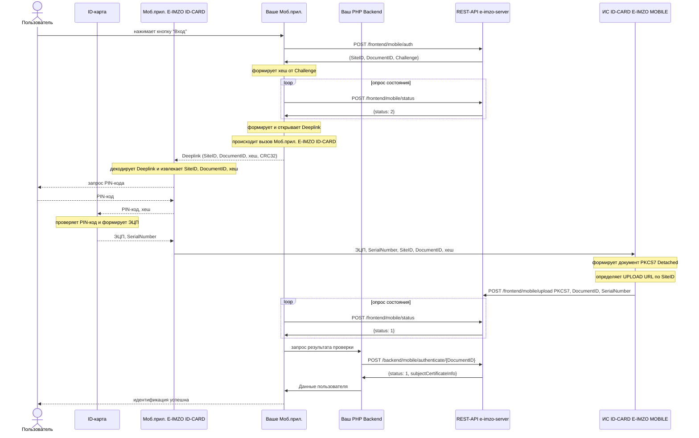
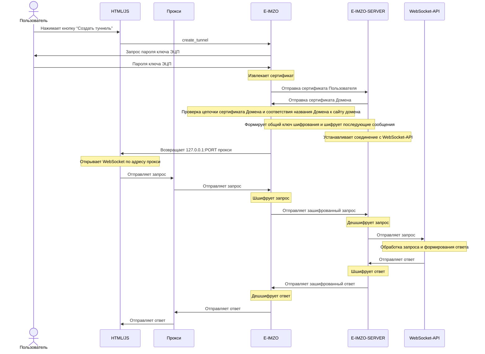

# E-IMZO - ИНСТРУКЦИЯ ПО ИНТЕГРАЦИИ

# 1. E-IMZO

## 1.1. Установка API-KEY для домена

Перед вызовом функций E-IMZO необходимо установить API-KEY для домена (с которого выполняется вызов) при загрузки HTML-страницы (window.onload)

    var API_KEYS = [
      'localhost', '96D0C1491615C82B9A54D9989779DF825B690748224C2B04F500F370D51827CE2644D8D4A82C18184D73AB8530BB8ED537269603F61DB0D03D2104ABF789970B',
      '127.0.0.1', 'A7BCFA5D490B351BE0754130DF03A068F855DB4333D43921125B9CF2670EF6A40370C646B90401955E1F7BC9CDBF59CE0B2C5467D820BE189C845D0B79CFC96F'
      // добавьте свой Домен и API-KEY сюда
    ];
    
    CAPIWS.apikey(API_KEYS, function (event, data) {
        console.log(data);
        if (data.success) {
            // Успешно - можно вызывать функции E-IMZO

        } else {
            // Ошибка - возможно API-KEY недействительный
            window.alert(data.reason);
        }
    }, 
    function(error){
      // Ошибка WebSocket соединения
      window.alert(error);
    });

## 1.2. Создание документа PKCS#7

Для создание документа [PKCS#7](https://www.rfc-editor.org/rfc/rfc2315) применяется функция [`create_pkcs7`](http://127.0.0.1:64646/apidoc.html#pkcs7.create_pkcs7)

    CAPIWS.callFunction({
        plugin    :"pkcs7",
        name      :"create_pkcs7",
        arguments :[
          //Данные в кодировке BASE64 (будут предваритьльно декодированы, подписаны и вложены в документ)
          data_64,
          //Идентификатор ключа подписывающего лица (полученный из фукнции других плагинов)
          id,
          //Возможные значения: 'yes' - будет создан PKCS#7/CMS документ без вложения исходных данных, 'no' или '' - будет создан PKCS#7/CMS документ с вложением исходных данных
          detached
        ]
      },
      function(event, data){
        console.log(data);
        if (data.success) {
          // Успешно
          var pkcs7 = data.pkcs7_64;
                
        } else {
          // Ошибка обработки в E-IMZO
          window.alert(data.reason);
        }
      },
      function(error){
        // Ошибка WebSocket соединения
        window.alert(error);
      }
    );

Параметр `id`:
 - Если нужно подписать ключем PFX, то `id` нужно получить из функции `load_key`
 - Если нужно подписать ключем ID-карты, то `id` = `"idcard"`

Смотрите пример https://test.e-imzo.uz/demo/

## 2. E-IMZO-SERVER

E-IMZO-SERVER - ПО предназначена для Аутентификации пользователя по ЭЦП и Проверки подписи PKCS#7 документа. 

## 2.1. Запуск и настройка

Для запуска требуется:
 - JRE v1.8. (update 322) (Docker image: `openjdk:8u322-oraclelinux8`)
 - Интернет соединение до сервера `vpn.e-imzo.uz:3443` (`testvpn.e-imzo.uz:2443` для тестирования) (сервера доступны только из Узбекистана).
 - Файлы конфигурации и VPN-ключи (могут быть в отдельном zip файле, извлеките их в директорию где находится e-imzo-server.jar).

Запуск выполняется командой:

    java -Dfile.encoding=UTF-8 -jar e-imzo-server.jar config.properties

После запуска в консоле напечатается лог примерно следующего содержания:
```
Sep 27, 2022 9:55:03 AM uz.yt.eimzo.server.Application main
INFO: e-imzo-server version: 1.1.1
********************************************************************************

УСЛОВИЯ ИСПОЛЬЗОВАНИЯ ПРОГРАММНОГО ОБЕСПЕЧЕНИЯ E-IMZO-SERVER 
НАУЧНО-ИНФОРМАЦИОННОГО ЦЕНТРА НОВЫХ ТЕХНОЛОГИЙ (НИЦ)

Эти условия являются соглашением между НИЦ и Вами. Пожалуйста, прочтите их. 
Они применяются к вышеуказанному программному обеспечению. 

Используя это программное обеспечение, Вы тем самым подтверждаете свое согласие 
соблюдать данные условия. Если Вы не согласны, не используйте это программное 
обеспечение. 

Программное обеспечение можно использовать только в пределах прав, 
предоставляемых заключенным договором (для проверки электронной цифровой 
подписи формата PKCS#7).

Данное программное обеспечение содержит другие модули. Использование модулей, 
без заключенного письменного договора является нарушением авторского права НИЦ.

НИЦ не несет ответственности за последствия использования  модулей 
E-IMZO-SERVER без заключенного письменного договора.

********************************************************************************

Sep 27, 2022 9:55:03 AM uz.yt.eimzo.server.Application loadConfig
INFO: Config file:config.properties
Sep 27, 2022 9:55:03 AM uz.yt.eimzo.server.Application loadConfig
INFO: Loading config from file:/e-imzo-server/config.properties
Sep 27, 2022 9:55:04 AM uz.yt.eimzo.server.service.cache.local.LocalCache <init>
INFO: Using LocalCache
Sep 27, 2022 9:55:04 AM uz.yt.eimzo.server.Application main
INFO: Registered: /frontend/challenge
SLF4J: Failed to load class "org.slf4j.impl.StaticLoggerBinder".
SLF4J: Defaulting to no-operation (NOP) logger implementation
SLF4J: See http://www.slf4j.org/codes.html#StaticLoggerBinder for further details.
Sep 27, 2022 9:55:04 AM uz.yt.eimzo.server.service.notifier.vpn.VpnNotifier <init>
INFO: Using VpnNotifier
Sep 27, 2022 9:55:04 AM uz.yt.eimzo.server.Application main
INFO: Registered: /backend/auth
Sep 27, 2022 9:55:04 AM uz.yt.eimzo.server.Application main
INFO: Registered: /frontend/timestamp/pkcs7
Sep 27, 2022 9:55:04 AM uz.yt.eimzo.server.Application main
INFO: Registered: /frontend/timestamp/data
Sep 27, 2022 9:55:04 AM uz.yt.eimzo.server.Application main
INFO: Registered: /backend/pkcs7/verify/attached
Sep 27, 2022 9:55:04 AM uz.yt.eimzo.server.Application main
INFO: Registered: /backend/pkcs7/verify/detached
Sep 27, 2022 9:55:04 AM uz.yt.eimzo.server.Application main
INFO: Registered: /frontend/pkcs7/make-attached
Sep 27, 2022 9:55:04 AM uz.yt.eimzo.server.Application main
INFO: Registered: /frontend/pkcs7/join
Sep 27, 2022 9:55:04 AM uz.yt.eimzo.server.Application main
INFO: Started http server on: /0.0.0.0:8080

```
Содержание файла конфигурации `config.properties`:
```
# слушать со всех IP-адресов сетевых карт и слушать порт 
listen.ip=0.0.0.0
listen.port=8080

# Адрес VPN-сервера
vpn.tls.enabled=yes
vpn.connect.host=vpn.e-imzo.uz
vpn.connect.port=3443

# Файлы VPN-ключей
vpn.key.file.path=keys/example.uz-2022-10-24.key
vpn.key.password=19E581A1AF9382F0
vpn.truststore.file.path=keys/vpn.jks
tsp.jks.file.path=keys/truststore.jks
```
*Тестовая конфигурация может отличаться от приведенной выше конфигурации*

Для проверки VPN соединения выполните CURL команду:
```
curl -v http://127.0.0.1:8080/ping
```
Ответ
```
{
  "serverDateTime": "2022-10-06 16:47:29",
  "yourIP": "127.0.0.1",
  "vpnKeyInfo": {
    "serialNumber": "3",
    "X500Name": "CN=Client",
    "validFrom": "2022-09-24 12:17:24",
    "validTo": "2022-10-24 12:17:24"
  }
}
```
HTTP 200 - означает успешное выполнение HTTP запроса

`serverDateTime` - Дата и время на сервере.

`yourIP` - IP-адрес вашего сервера.

`vpnKeyInfo` - Данные VPN-ключа.

### 2.1.1. Запуск на двух и более серверов

При запуске E-IMZO-SERVER на двух и более серверов, они должны будут подключаться к одному Redis-серверу. Для этого нужно прописать в файл конфигурации `config.properties`: 
```
cache.type=redis
# IP-адрес Redis-сервера
cache.redis.host=127.0.0.1
# TCP-порт Redis-сервера
cache.redis.port=6379
cache.redis.connect.timeout.ms=2000
cache.redis.so.timeout.ms=2000
# Пароль Redis-сервера
cache.redis.password=test
# Номер БД Redis-сервера
cache.redis.db=0
```
Балансировку нагрузки можно осуществить с помощью `Nginx` (см. соответствующую документацию). 

## 2.2. Описание методов E-IMZO-SERVER

E-IMZO-SERVER предоставляет REST-API методы к которым может обращаться Backend приложение или HTML/JavaScript приложение на прямую.

Методы начинающиеся с `/backend` **должны быть доступны только Backend приложению**, а методы начинающиеся с `/frontend` могут быть доступны как Backend приложению так и HTML/JavaScript приложению.

Изоляцию методов можно осуществить с помощью `Nginx`.
Пример конфигурации `Nginx`:
```
server {
	listen 80;
	
	root /usr/share/nginx/html;
	index index.html index.htm;
	
	server_name example.uz;

	location /frontend {
		proxy_set_header   Host             $host;
		proxy_set_header   X-Real-IP        $remote_addr;
		proxy_set_header   X-Forwarded-For  $proxy_add_x_forwarded_for;

		proxy_pass http://E-IMZO-SERVER:8080;
	}	
  
	location / {
		proxy_set_header   Host             $host;
		proxy_set_header   X-Real-IP        $remote_addr;
		proxy_set_header   X-Forwarded-For  $proxy_add_x_forwarded_for;

		proxy_pass http://YOUR-BACKEND-APP:8080;
	}

}
```
`YOUR-BACKEND-APP:8080` - IP-Адрес и порт сервера где работает ваше Backend приложение.

`E-IMZO-SERVER:8080` - IP-Адрес и порт сервера где работает E-IMZO-SERVER.

### 2.2.1. `/frontend/challenge`

Метод нужен для генерации случайного значение `Challenge` которое пользоваетль должен будет подписать и создать PKCS#7 документ.

Пример вызова CURL командой:
```
curl -v http://127.0.0.1:8080/frontend/challenge
```
Ответ
```
{
  "challenge": "9b573e40-cefd-42cc-a534-f6e78b27c2ae",
  "ttl": 120,
  "status": 1,
  "message": ""
}
```
HTTP 503 - Посмотрите лог E-IMZO-SERVER.

HTTP 400 - означает что есть ошибка в параметрах запроса. Посмотрите лог E-IMZO-SERVER.

HTTP 200 - означает успешное выполнение HTTP запроса

`status` - код состояния (1 - Успешно, иначе ошибка)

`message` - если `status` не равно 1, то сообщения об ошибки.

`challenge` - случайного значение которое пользоваетль должен будет подписать и создать PKCS#7 документ с помощю E-IMZO.

`ttl` - время жизни `challenge` в секундах.

*ВАЖНО ! Ответ не должен кешироваться в прокси или web-сервере.*

Смотрите пример http://test.e-imzo.uz/demo/

### 2.2.2. `/backend/auth`

Метод нужен для аутентификации пользователя по PKCS#7 документу которое содежит `Challenge`

Пример вызова CURL командой:

```
curl -v -H 'X-Real-IP: 1.2.3.4' -H 'Host: example.uz' -X POST -d 'MIAGCSqGSIb...ak5wAAAAAAAA=' http://127.0.0.1:8080/backend/auth
```
В HTTP -заголовке  `X-Real-IP` - должен передаваться  IP-Адрес пользователя а в `Host` - должен передаваться доменное имя сайта куда пользователь выполяет Вход.

Тело запроса должно содержать Base64-закодированный PKCS#7 документ.

Ответ:
```
{
  "subjectCertificateInfo": {
    "serialNumber": "218711a92",
    "subjectName": {
      "1.2.860.3.16.1.2": "11111111111111",
      "CN": "sfasdfa s asdfasd"
    },
    "validFrom": "2022-09-24 17:29:21",
    "validTo": "2022-10-24 17:29:21"
  },
  "status": 1,
  "message": ""
}
```
HTTP 503 - Посмотрите лог E-IMZO-SERVER.

HTTP 400 - означает что есть ошибка в параметрах запроса. Посмотрите лог E-IMZO-SERVER.

HTTP 200 - означает успешное выполнение HTTP запроса

`status` - код состояния (1 - Успешно, иначе ошибка)

| status | Описание |
|--|--|
| 1 | Успешно |
| -1 | Неудалось проверить статус сертификата. Посмотрите лог E-IMZO-SERVER. |
| -5 | Время подписи недействительна. Проверьте дату и время компьютера пользователя. |
| -10 | ЭЦП недействительна |
| -11 | Сертификат недействителен |
| -12 | Сертификат недействителен на дату подписи |
| -20 | Не найден challenge или срок его истек. Повторите заного. |

`message` - если `status` не равно 1, то сообщения об ошибки.

`subjectCertificateInfo` - информация о серитификате пользователя.


Смотрите пример http://test.e-imzo.uz/demo/

### 2.2.3. `/frontend/timestamp/pkcs7`

Метод нужен для прикрепления токена штампа времени к PKCS#7 документу.

Пример вызова CURL командой:
```
curl -v -H 'X-Real-IP: 1.2.3.4' -H 'Host: example.uz' -X POST -d 'MIAGCSq...GekNAAAAAAAA' http://127.0.0.1:8080/frontend/timestamp/pkcs7
```
В HTTP -заголовке  `X-Real-IP` - должен передаваться  IP-Адрес пользователя а в `Host` - должен передаваться доменное имя сайта где пользователь подписал документ и создал PKCS#7 документ.

Тело запроса должно содержать Base64-закодированный PKCS#7 документ.

Ответ:
```
{
  "pkcs7b64": "MIAGCSqG...bAAAAAAAA",
  "timestampedSignerList": [
    {
      "serialNumber": "218711a92",
      "subjectName": {
        "1.2.860.3.16.1.2": "11111111111111",
        "CN": "sfasdfa s asdfasd"
      },
      "validFrom": "2022-09-24 17:29:21",
      "validTo": "2022-10-24 17:29:21"
    }
  ],
  "status": 1,
  "message": ""
}
```
HTTP 503 - Посмотрите лог E-IMZO-SERVER.

HTTP 400 - означает что есть ошибка в параметрах запроса. Посмотрите лог E-IMZO-SERVER.

HTTP 200 - означает успешное выполнение HTTP запроса

`status` - код состояния (1 - Успешно, иначе ошибка)

`message` - если `status` не равно 1, то сообщения об ошибки.

`timestampedSignerList` - информация о серитификате пользователя к подписи которому был прикреплен токен штампа времени. Если массив пуст, то скорее всего отправленный PKCS#7 документ уже содержит токен штампа времени.

`pkcs7b64` - PKCS#7 документ с прикрепленным токеном штампа времени.

Смотрите пример http://test.e-imzo.uz/demo/

### 2.2.4. `/backend/pkcs7/verify/attached`

Метод для проверки подписи PKCS#7Attached документа с прикрепленным токеном штампа времени.

Пример вызова CURL командой:
```
curl -v -H 'X-Real-IP: 1.2.3.4' -H 'Host: example.uz' -X POST -d 'MIAGCSq...GekNAAAAAAAA' http://127.0.0.1:8080/backend/pkcs7/verify/attached
```
В HTTP -заголовке  `X-Real-IP` - должен передаваться  IP-Адрес пользователя а в `Host` - должен передаваться доменное имя сайта где пользователь подписал документ и создал PKCS#7 документ.

Тело запроса должно содержать Base64-закодированный PKCS#7 документ.

Ответ:
```
{
  "pkcs7Info": {
    "signers": [
      {
        "signerId": {
          "issuer": "CN=TestCA,O=test.e-imzo.uz",
          "subjectSerialNumber": "218711a92"
        },
        "signingTime": "2022-09-27 11:17:53",
        "signature": "a88ab92b3eed2221925a8532a88ff52d94fc7fa2d0b3579f614822f0723395ee4727de2ed694a21715879637b3181febb94da9016f5a1737d7e9f9920719e90d",
        "digest": "3369cd520c8e556502b9bc0ac34ca69cafee96f2f4a8371a63d4dd7d3a458d05",
        "timeStampInfo": {
          "certificate": [
            {
              "subjectInfo": {
                "CN": "TSA",
                "O": "test.e-imzo.uz"
              },
              "issuerInfo": {
                "CN": "TestCA",
                "O": "test.e-imzo.uz"
              },
              "serialNumber": "218711a50",
              "subjectName": "CN=TSA,O=test.e-imzo.uz",
              "validFrom": "2022-09-15 12:19:13",
              "validTo": "2027-09-15 12:19:13",
              "issuerName": "CN=TestCA,O=test.e-imzo.uz",
              "publicKey": {
                "keyAlgName": "OZDST-1092-2009-2",
                "publicKey": "MGAwGQYJKoZcAw8BAQIBMAwGCiqGXAMPAQECAQEDQwAEQGH1kMo1AelwZDhM/vQLX1CIsnLlyBIWBd/UNZhcfWeGZhSa9BdIDak6Ro2e4lWm77lssBbqQfeVO+ieuYp6qv4="
              },
              "signature": {
                "signAlgName": "OZDST-1106-2009-2-AwithOZDST-1092-2009-2",
                "signature": "aa67e8f444bde68ad365892d94a29fd1cb129acefb318b4099a103e85b1b71337a5535e012663bc0f6fc172096bdde558cedc32e7a8383c35746c1a807bd337b"
              }
            },
            {
              "subjectInfo": {
                "CN": "TestCA",
                "O": "test.e-imzo.uz"
              },
              "issuerInfo": {
                "CN": "TestRoot"
              },
              "serialNumber": "648484238a3380a7",
              "subjectName": "CN=TestCA,O=test.e-imzo.uz",
              "validFrom": "2022-09-15 12:19:13",
              "validTo": "2027-09-15 12:19:13",
              "issuerName": "CN=TestRoot",
              "publicKey": {
                "keyAlgName": "OZDST-1092-2009-2",
                "publicKey": "MGAwGQYJKoZcAw8BAQIBMAwGCiqGXAMPAQECAQEDQwAEQPukdUklFYxOLtzSKjnJqFamWaVX+zbyekEayLz69NIis8fxRZUMIVmGljwvQrPmtHXXDL281MNMM3vAcY0XR/A="
              },
              "signature": {
                "signAlgName": "OZDST-1106-2009-2-AwithOZDST-1092-2009-2",
                "signature": "dabe206257ed646465f56d2c4cd1f993172975d1c1dd2970c8227f95139c44a77fda504a13344683b0a97fe8833dcfc48f3cc2ac281d111bda60b9e94bddb656"
              }
            }
          ],
          "OCSPResponse": "MIIGdTCBr6...YLnpS922Vg==",
          "statusUpdatedAt": "2022-09-27 11:26:08",
          "statusNextUpdateAt": "2022-09-27 11:27:08",
          "digestVerified": true,
          "certificateVerified": true,
          "trustedCertificate": {
            "subjectInfo": {
              "CN": "TestRoot"
            },
            "issuerInfo": {
              "CN": "TestRoot"
            },
            "serialNumber": "cfd4becd127e5063",
            "subjectName": "CN=TestRoot",
            "validFrom": "2022-08-22 12:19:13",
            "validTo": "2042-08-22 12:19:13",
            "issuerName": "CN=TestRoot",
            "publicKey": {
              "keyAlgName": "OZDST-1092-2009-2",
              "publicKey": "MGAwGQYJKoZcAw8BAQIBMAwGCiqGXAMPAQECAQEDQwAEQK9gMs6YLoWRm3C2sN8jTwxs5rC/XhUERW11h0XeNGglOTMO8rtFKNKJjQNwcG5oyn8OLOfnlR0g2ymGNi7ud3c="
            },
            "signature": {
              "signAlgName": "OZDST-1106-2009-2-AwithOZDST-1092-2009-2",
              "signature": "be8a5e9c656ae4b81fdba479c59857f9063e08604d441f3c635ebdf95d976263292200c33b309e7cb5a4d190997f945cdfeef7e6fb3f6f57a5ce477a0caaa129"
            }
          },
          "certificateValidAtSigningTime": true,
          "signerId": {
            "issuer": "CN=TestCA,O=test.e-imzo.uz",
            "subjectSerialNumber": "218711a50"
          },
          "tsaPolicy": "1.2.860.3.2.11.1",
          "time": "2022-09-27 11:18:53",
          "hashAlgorithm": "1.2.860.3.15.1.3.2.1.1",
          "serialNumber": "13219ec520231519",
          "tsa": "6: http://test.e-imzo.uz/cams/tst",
          "messageImprintAlgOID": "1.2.860.3.15.1.3.2.1.1",
          "messageImprintDigest": "e96377344d7bab212bcb6c6b82c25fb61600bb4d3f9645aa40c3ec51e4827605",
          "verified": true
        },
        "certificate": [
          {
            "subjectInfo": {
              "1.2.860.3.16.1.2": "11111111111111",
              "CN": "sfasdfa s asdfasd"
            },
            "issuerInfo": {
              "CN": "TestCA",
              "O": "test.e-imzo.uz"
            },
            "serialNumber": "218711a92",
            "subjectName": "CN=sfasdfa s asdfasd,1.2.860.3.16.1.2=11111111111111",
            "validFrom": "2022-09-24 17:29:21",
            "validTo": "2022-10-24 17:29:21",
            "issuerName": "CN=TestCA,O=test.e-imzo.uz",
            "publicKey": {
              "keyAlgName": "OZDST-1092-2009-2",
              "publicKey": "MGAwGQYJKoZcAw8BAQIBMAwGCiqGXAMPAQECAQEDQwAEQH7cS8X50WPYfroxrnD6DKpUChb845rKi6Dac+B95rZ8QDoQn1o6QcHbuMihP4g8ZyEIxEjChHRrl1b1kOSJUrc="
            },
            "signature": {
              "signAlgName": "OZDST-1106-2009-2-AwithOZDST-1092-2009-2",
              "signature": "a30226a14ad8c6f3ccb0ac57c81262c39543f6bd6aa69f761a9920d68992bf656405edb9d0b91fce36d999ffccdeb1d7bfd343e5c6ae0c3c6c4776ca43b32c38"
            }
          },
          {
            "subjectInfo": {
              "CN": "TestCA",
              "O": "test.e-imzo.uz"
            },
            "issuerInfo": {
              "CN": "TestRoot"
            },
            "serialNumber": "648484238a3380a7",
            "subjectName": "CN=TestCA,O=test.e-imzo.uz",
            "validFrom": "2022-09-15 12:19:13",
            "validTo": "2027-09-15 12:19:13",
            "issuerName": "CN=TestRoot",
            "publicKey": {
              "keyAlgName": "OZDST-1092-2009-2",
              "publicKey": "MGAwGQYJKoZcAw8BAQIBMAwGCiqGXAMPAQECAQEDQwAEQPukdUklFYxOLtzSKjnJqFamWaVX+zbyekEayLz69NIis8fxRZUMIVmGljwvQrPmtHXXDL281MNMM3vAcY0XR/A="
            },
            "signature": {
              "signAlgName": "OZDST-1106-2009-2-AwithOZDST-1092-2009-2",
              "signature": "dabe206257ed646465f56d2c4cd1f993172975d1c1dd2970c8227f95139c44a77fda504a13344683b0a97fe8833dcfc48f3cc2ac281d111bda60b9e94bddb656"
            }
          }
        ],
        "OCSPResponse": "MIIGdTCBr...pS922Vg==",
        "statusUpdatedAt": "2022-09-27 11:26:07",
        "statusNextUpdateAt": "2022-09-27 11:27:07",
        "verified": true,
        "certificateVerified": true,
        "trustedCertificate": {
          "subjectInfo": {
            "CN": "TestRoot"
          },
          "issuerInfo": {
            "CN": "TestRoot"
          },
          "serialNumber": "cfd4becd127e5063",
          "subjectName": "CN=TestRoot",
          "validFrom": "2022-08-22 12:19:13",
          "validTo": "2042-08-22 12:19:13",
          "issuerName": "CN=TestRoot",
          "publicKey": {
            "keyAlgName": "OZDST-1092-2009-2",
            "publicKey": "MGAwGQYJKoZcAw8BAQIBMAwGCiqGXAMPAQECAQEDQwAEQK9gMs6YLoWRm3C2sN8jTwxs5rC/XhUERW11h0XeNGglOTMO8rtFKNKJjQNwcG5oyn8OLOfnlR0g2ymGNi7ud3c="
          },
          "signature": {
            "signAlgName": "OZDST-1106-2009-2-AwithOZDST-1092-2009-2",
            "signature": "be8a5e9c656ae4b81fdba479c59857f9063e08604d441f3c635ebdf95d976263292200c33b309e7cb5a4d190997f945cdfeef7e6fb3f6f57a5ce477a0caaa129"
          }
        },
        "policyIdentifiers": [
          "1.3.6.1.4.1.46709.1.2.2",
          "1.3.6.1.4.1.46709.1.2.4",
          "1.3.6.1.4.1.46709.1.2.1",
          "1.3.6.1.4.1.46709.1.2.3"
        ],
        "certificateValidAtSigningTime": true
      }
    ],
    "documentBase64": "c29tZSBkb2N1bWVudA=="
  },
  "status": 1,
  "message": ""
}
```
HTTP 503 - Посмотрите лог E-IMZO-SERVER.

HTTP 400 - означает что есть ошибка в параметрах запроса. Посмотрите лог E-IMZO-SERVER.

HTTP 200 - означает успешное выполнение HTTP запроса

`status` - код состояния (1 - Успешно, иначе ошибка)

| status | Описание |
|--|--|
| 1 | Успешно |
| -1 | Неудалось проверить статус сертификата. Посмотрите лог E-IMZO-SERVER. |
| -10 | ЭЦП недействительна |
| -11 | Сертификат недействителен |
| -12 | Сертификат недействителен на дату подписи |
| -20 | Неудалось проверить статус сертификата Timestamp. Посмотрите лог E-IMZO-SERVER. |
| -21 | ЭЦП или хеш Timestamp недействительна |
| -22 | Сертификат Timestamp недействителен |
| -23 | Сертификат Timestamp недействителен на дату подписи |

`message` - если `status` не равно 1, то сообщения об ошибки.

`pkcs7Info` - информация о проверки подписи PKCS#7 документа.

| Поле | Описание |
|--|--|
| pkcs7Info.documentBase64 | подписанный документ в кодировке (Base64) |
| pkcs7Info.signers[N] | информация о том кто подписал документ |
| pkcs7Info.signers[N].certificate[0] | информация о сертификате пользователя |
| pkcs7Info.signers[N].certificate[1] | информация о сертификате ЦРК |
| pkcs7Info.signers[N].certificate[2] | информация о корневом сертификате (если имеется) |
| pkcs7Info.signers[N].OCSPResponse | OCSP ответ от сервера ЦРК |
| pkcs7Info.signers[N].signingTime | дата на компьютере пользователя при подписании (при получении сервером подписанного документа следует сверить это поле с реальным временем если PKCS#7 документ не содержит токен штампа времени). токен штампа времени - содержит ЭЦП документа и точную дату и время подписи, выдается сервером Доверительной третьей стороны в виде подписанного электронной цифровой подписью документа, которая подтверждает что ЭЦП документа была создана в определенный момент времени. |
| pkcs7Info.signers[N].verified | ЭЦП действительна (если true - да, если false нет) |
| pkcs7Info.signers[N].certificateVerified | цепочка сертификатов действительна (если true - да, если false нет) |
| pkcs7Info.signers[N].revokedStatusInfo | Если сертификат пользователя был приостановлен или отозван, то поле содержит дату и причину. |
| pkcs7Info.signers[N].certificateValidAtSigningTime | сертификат действителен на дату подписи (если true - да, если false нет). За дату подписи берется поле pkcs7Info.signers[N].signingTime или дата и время токена штампа времени (если присутствует) |
| pkcs7Info.signers[N].exception | ошибка при проверке подписи (причина ошибки при проверке подписи или статуса сертификата) |
| UID | Физ.ИНН. |
| 1.2.860.3.16.1.2 | ПИНФЛ |
| 1.2.860.3.16.1.1 | Юр.ИНН (поле отсутствует если субъект является физ. лицом) |

Смотрите пример http://test.e-imzo.uz/demo/

### 2.2.5. `/backend/pkcs7/verify/detached`

Метод для проверки подписи PKCS#7Detached документа с прикрепленным токеном штампа времени.

Пример вызова CURL командой:
```
curl -v -H 'X-Real-IP: 1.2.3.4' -H 'Host: example.uz' -X POST -d 'c29tZ...VudA==|MIAGCSq...GekNAAAAAAAA' http://127.0.0.1:8080/backend/pkcs7/verify/attached
```
В HTTP -заголовке  `X-Real-IP` - должен передаваться  IP-Адрес пользователя а в `Host` - должен передаваться доменное имя сайта где пользователь подписал документ и создал PKCS#7 документ.

Тело запроса должно содержать Base64-закодированный исходный документ и Base64-закодированный PKCS#7 документ разделенный символом `|`.

Ответ такой же как в методе `/backend/pkcs7/verify/attached` но json не содержит поле `pkcs7Info.documentBase64`.

Смотрите пример http://test.e-imzo.uz/demo/

### 2.2.6. `/frontend/pkcs7/make-attached`

Метод для формирования PKCS#7/Attached документа из исходного и PKCS#7Detached документов

Пример вызова CURL командой:
```
curl -v -H 'X-Real-IP: 1.2.3.4' -H 'Host: example.uz' -X POST -d 'c29tZSB...udA==|MIAGCSq...GekNAAAAAAAA' http://127.0.0.1:8080/frontend/pkcs7/make-attached
```
В HTTP -заголовке  `X-Real-IP` - должен передаваться  IP-Адрес пользователя а в `Host` - должен передаваться доменное имя сайта где пользователь подписал документ и создал PKCS#7 документ.

Тело запроса должно содержать Base64-закодированный исходный документ и Base64-закодированный PKCS#7 документ разделенный символом `|`.

Ответ:
```
{
  "pkcs7b64": "MIAGCSqG...wAAAAAAAA==",
  "status": 1,
  "message": ""
}
```
HTTP 503 - Посмотрите лог E-IMZO-SERVER.

HTTP 400 - означает что есть ошибка в параметрах запроса. Посмотрите лог E-IMZO-SERVER.

HTTP 200 - означает успешное выполнение HTTP запроса

`status` - код состояния (1 - Успешно, иначе ошибка)

`message` - если `status` не равно 1, то сообщения об ошибки.

`pkcs7b64` - PKCS#7/Attached документ.

### 2.2.7. `/frontend/pkcs7/join`

Метод для склеивания двух PKCS#7/Attached документов и формирования одного PKCS#7/Attached документа, при условии что оба PKCS#7/Attached содержат один и тот же исходный документ. 

Пример вызова CURL командой:
```
curl -v -H 'X-Real-IP: 1.2.3.4' -H 'Host: example.uz' -X POST -d 'MIAGCSq...GekNAAAAAAAA|MIAGCSq...GekNAAAAAAAA' http://127.0.0.1:8080/frontend/pkcs7/join
```
В HTTP -заголовке  `X-Real-IP` - должен передаваться  IP-Адрес пользователя а в `Host` - должен передаваться доменное имя сайта где пользователь подписал документ и создал PKCS#7 документ.

Тело запроса должно содержать два Base64-закодированных PKCS#7 документов разделенных символом `|`.

Ответ:
```
{
  "pkcs7b64": "MIAGCSqG...wAAAAAAAA==",
  "status": 1,
  "message": ""
}
```
HTTP 503 - Посмотрите лог E-IMZO-SERVER.

HTTP 400 - означает что есть ошибка в параметрах запроса. Посмотрите лог E-IMZO-SERVER.

HTTP 200 - означает успешное выполнение HTTP запроса

`status` - код состояния (1 - Успешно, иначе ошибка)

`message` - если `status` не равно 1, то сообщения об ошибки.

`pkcs7b64` - склеенный в один PKCS#7/Attached документ.

# 3. ID-CARD E-IMZO MOBILE REST-API

## ТЕРМИНЫ И ОПРЕДЕЛЕНИЯ

  - ИС - информационная система.
  - NFC - «ближняя бесконтактная связь». Технология беспроводной передачи данных малого радиуса действия, которая дает возможность обмена данными между устройствами, находящимися на расстоянии около 10 сантиметров.
  - Смартфон - мобильный телефон (современный — как правило, с сенсорным
экраном), дополненный функциональностью карманного персонального
компьютера.
  - ID-карта - пластиковая карта со встроенной микросхемой, содержит микропроцессор и операционную систему, обладают возможностью проводить криптографические вычисления по стандарту O'zDSt 1092:2009 - «Процессы формирования и проверки электронной цифровой подписи» посредством установленного Java-апплета E-IMZO.
  - HTTP - «протокол передачи гипертекста» - протокол прикладного уровня передачи данных, изначально - в виде гипертекстовых документов в формате HTML, в настоящее время используется для передачи произвольных данных.
  - PKCS#7 - В криптографии - «синтаксис криптографических сообщений» - это стандартный синтаксис для хранения подписанных и / или зашифрованных данных.
  - PKCS#7 Attached - PKCS#7 документ который содержит исходный документ, ее ЭЦП, цепочку сертификатов субъекта подписавшего исходный документ.
  - PKCS#7 Detached - PKCS#7 документ который не содержит исходный документ а только ее ЭЦП, цепочку сертификатов субъекта подписавшего исходный документ. В процессе проверки ЭЦП PKCS#7 документа, должен быть предоставлен исходный документ как отдельный файл.
  - URL - Унифицированный указатель ресурса, система унифицированных адресов электронных ресурсов, или единообразный определитель местонахождения ресурса.
  - Клиент - ИС которая подключена к ИС “ID-CARD E-IMZO MOBILE” и использует ее ресурсы.
  - UPLOAD URL - HTTP-адрес Клиента, куда ИС “ID-CARD E-IMZO MOBILE” отправит PKCS#7 Detached документ.
  - SiteID - идентификатор UPLOAD URL Клиента.
  - DocumentID - идентификатор документа (для подписи) в ИС Клиента.
  - SerialNumber - серийный номер сертификата пользователя.
  - Challenge - текст который состоит из случайных символов и штампа времени.
  - REST - (от англ. Representational State Transfer - «передача состояния представления») - архитектурный стиль взаимодействия компонентов распределенного приложения в сети.
  - API - (программный интерфейс приложения, интерфейс прикладного программирования) (англ. application programming interface, API — описание способов (набор классов, процедур, функций, структур или констант), которыми одна компьютерная программа может взаимодействовать с другой программой.
  - Nginx - веб-сервер и почтовый прокси-сервер, работающий на Unix-подобных операционных системах.
  - Redis - резидентная система управления базами данных класса NoSQL с открытым исходным кодом, работающая со структурами данных типа «ключ - значение».
  - PHP - скриптовый язык общего назначения, интенсивно применяемый для разработки веб-приложений.

E-IMZO ID-CARD REST-API предоставляет REST-API методы к которым может обращаться Backend приложение или Мобильное приложение.

## ОПИСАНИЕ ИС “ID-CARD E-IMZO MOBILE”

ИС “ID-CARD E-IMZO MOBILE” дает возможность ИС Клиента идентифицировать владельца ID-карты и предоставляет возможность подписания электронного документа электронной цифровой подписью закрытым ключом хранящимся в ID-карте владельца (пользователя).

## 3.1. Технические требования

### 3.1.1. Технические требования к ИС Клиента

  - В ИС Клиента должен быть установлен Nginx.
  - В ИС Клиента должен быть установлен Redis.
  - ИС Клиента должна быть доступна через интернет по протоколу HTTP/HTTPS.
  - ИС Клиента должна иметь постоянный UPLOAD URL.
  - ИС Клиента должна быть зарегистрирована в ИС “ID-CARD E-IMZO MOBILE” и получить SiteID.

### 3.1.2. Технические требования к пользователю

  - Пользователь должен обладать ID-картой.
  - Пользователь должен обладать смартфоном оборудованным считывателем NFC.
  - Сертификат ЭЦП пользователя должен быть действительным.
  - На смартфоне пользователя должно быть установлено мобильное приложение E-IMZO ID-CARD (https://play.google.com/store/apps/details?id=uz.yt.idcard.eimzo).

## 3.2. Принцип работы

Демо сайт и пример https://test.e-imzo.uz/demo/eimzoidcard/

### 3.2.1. Идентификация Пользователя

Последовательность операций для выполнения идентификации по ЭЦП в мобильное приложение:


### 3.2.2. Подписание документа Пользователя

Последовательность операций для подписания электронного документа пользователя в мобильном приложении:


### 3.2.3. Описание кода status

Для `/fontend/mobile`

| status | Описание |
|--|--|
| 0 | Плохой ответ (никогда не должно возвращаться) |
| 1 | Успешно |
| 2 | PKCS#7 еще не загружен со стороны ИС “ID-CARD E-IMZO MOBILE” |
| -1 | Ошибка связанная с Redis (возможно к нему не удалось подключиться) |
| -2 | Запись по DocumentID не найдена в Redis (возможно истекло время жизни записи) |
| -9 | Непредвиденная ошибка (смотрите записи в логе E-IMZO-SERVER) |
| -10 | Cмотрите записи в логе E-IMZO-SERVER |

Для `/backend/mobile`

| status | Описание |
|--|--|
| 0 | Плохой ответ (никогда не должно возвращаться) |
| 1 | Успешно |
| 2 | PKCS#7 еще не загружен со стороны ИС “ID-CARD E-IMZO MOBILE” |
| -1 | Ошибка связанная с Redis (возможно к нему не удалось подключиться) |
| -2 | Запись по DocumentID не найдена в Redis (возможно истекло время жизни записи) |
| -3 | Cмотрите записи в логе E-IMZO-SERVER |
| -4 | Структура PKCS#7 документа недейтвительна (никогда не должно возвращаться) |
| -5 | ЭЦП PKCS#7 документа недействительна |
| -6 | Сертификат пользователя недействителен |
| -7 | Сертификат пользователя недействителен на дату и время подписи |
| -8 | Произошла ошибка при проверки статуса сертификата (смотрите записи в логе E-IMZO-SERVER) |
| -9 | Превышена разрешенная разность времени в минутах между датой и временем подписания в смартфоне и датой и временем проверки ЭЦП PKCS#7 документа на сервере. Пользователь должен повторить попытку или если интернет соединение медленное, то можно увеличить параметр конфигурации `auth.service.valid.minutes.window` |
| -10 | Cмотрите записи в логе E-IMZO-SERVER |
| -11 | Cмотрите записи в логе E-IMZO-SERVER |
| -99 | Cмотрите записи в логе E-IMZO-SERVER |
| -100 | Cмотрите записи в логе E-IMZO-SERVER |

## 3.3. Настройка конфигурации

Допишите следующие параметры в файл конфигурации `config.properties`:
```
# Пропишите свой SiteID
mobile.siteId=0000

# Укажите конфигурацию Redis
mobile.storage.redis.host=127.0.0.1
mobile.storage.redis.password=test
mobile.storage.redis.db=1

```

Перезапустите E-IMZO-SERVER.

Для проверки работоспособности REST-API `/frontend/mobile` выполните команду (допустим что ваш домен example.uz):

```
curl -X POST https://example.uz/frontend/mobile/auth
```

В ответ вернётся JSON-строка

```
{"status":1,"message":null,"siteId":"0000","documentId":"B7735734","challange":"AB8C2ED52B12DCBAB3FBD8C11007E4C0C7BF6A2F5818C05DEB61F3EE39052BDC"}
```

## 3.4. Описание методов ID-CARD E-IMZO MOBILE REST-API

### 3.4.1. `/frontend/mobile/upload`

Метод нужен для того чтобы ИС “ID-CARD E-IMZO MOBILE” отправила PKCS#7 документ. 

_Например: если название вашего домена_ `example.uz` _то ваш_ `UPLOAD URL` _будет_ `https://example.uz/frontend/mobile/upload`

### 3.4.2. `/frontend/mobile/auth`

Метод нужен для генерации случайного значение `Challenge` которое пользоваетль должен будет подписать и создать PKCS#7 документ.

Пример вызова CURL командой:
```
curl -X POST -v http://127.0.0.1:8080/frontend/mobile/auth
```
Ответ
```
{
  "status": 1,
  "siteId": "0000",
  "documentId": "2944F1F2",
  "challange": "F8D2181DC6C02EA819B88FF3EF49BE0C"
}
```
HTTP 503 - Посмотрите лог E-IMZO-SERVER.

HTTP 400 - означает что есть ошибка в параметрах запроса. Посмотрите лог E-IMZO-SERVER.

HTTP 200 - означает успешное выполнение HTTP запроса

`status` - код состояния (1 - Успешно, иначе ошибка)

`challenge` - случайного значение которое пользоваетль должен будет подписать и создать PKCS#7 документ с помощю E-IMZO ID-CARD.

`siteId` - SiteID.

`documentId` - DocumentID.

`message` - если `status` не равно 1, то сообщения об ошибки.

Для формирования Deeplink применяется:
- Javascript-код https://test.e-imzo.uz/demo/eimzoidcard/js/e-imzo-mobile.js для веб-сайта
- Dart-код https://github.com/qo0p/E-IMZO-INTEGRATION/blob/dev/lib/login_viewmodel.dart функция `deepLink()` для Flutter проекта
- Java-код https://github.com/qo0p/SampleAndroidAppCallDeeplinkEIMZO/blob/master/app/src/main/java/uz/yt/sample/myapplication/MainActivity.java функция `makeAndCallDeepLink()` для Android проекта

### 3.4.3. `/frontend/mobile/status`

Метод нужен для проверки статуса после передачи по Deeplink.

Пример вызова CURL командой:
```
curl -X POST -d 'documentId=BBF3E8C3' -v http://127.0.0.1:8080/frontend/mobile/status
```

Тело запроса должно содержать URL-закодированный пареметр `documentId`.

Ответ
```
{
  "status": 2
}
```
HTTP 503 - Посмотрите лог E-IMZO-SERVER.

HTTP 400 - означает что есть ошибка в параметрах запроса. Посмотрите лог E-IMZO-SERVER.

HTTP 200 - означает успешное выполнение HTTP запроса

`status` - код состояния (см. 3.2.3. Описание кода status).

`message` - если `status` не равно 1, то сообщения об ошибки.

### 3.4.4. `/backend/mobile/authenticate`

Метод нужен для проверки результата идентификации пользователя со стороны Backend после того когда `/frontend/mobile/status` вернет  `{"status": 1}`.

Пример вызова CURL командой:
```
curl -X GET -H 'X-Real-IP: 1.2.3.4' -H 'Host: example.uz' -v http://127.0.0.1:8080/backend/mobile/authenticate/2944F1F2
```

В HTTP -заголовке  `X-Real-IP` - должен передаваться  IP-Адрес пользователя а в `Host` - должен передаваться доменное имя сайта куда пользователь выполяет Вход.

Ответ:
```
{
   "status":1,
   "subjectCertificateInfo":{
      "serialNumber":"7700000",
      "X500Name":"CN\u003dIVANOV IVAN IVANOVICH,Name\u003dIVAN,SURNAME\u003dIVANOV,UID\u003d400000000,1.2.860.3.16.1.2\u003d30000000000000",
      "subjectName":{
         "UID":"400000000",
         "SURNAME":"IVANOV",
         "1.2.860.3.16.1.2":"30000000000000",
         "CN":"IVANOV IVAN IVANOVICH",
         "Name":"IVAN"
      },
      "validFrom":"2022-09-16 12:21:38",
      "validTo":"2024-09-16 23:59:59"
   }
}
```
HTTP 503 - Посмотрите лог E-IMZO-SERVER.

HTTP 400 - означает что есть ошибка в параметрах запроса. Посмотрите лог E-IMZO-SERVER.

HTTP 200 - означает успешное выполнение HTTP запроса

`status` - код состояния (1 - Успешно, иначе ошибка)

`message` - если `status` не равно 1, то сообщения об ошибки.

`subjectCertificateInfo` - информация о серитификате пользователя.

### 3.4.5. `/frontend/mobile/sign`

Метод нужен для генерации DocumentID для идентификации пользовательского документа, пользоваетль должен будет подписать и создать PKCS#7 документ.

Пример вызова CURL командой:
```
curl -X POST -v http://127.0.0.1:8080/frontend/mobile/sign
```
Ответ
```
{
  "status": 1,
  "siteId": "0000",
  "documentId": "850FF727"
}
```
HTTP 503 - Посмотрите лог E-IMZO-SERVER.

HTTP 400 - означает что есть ошибка в параметрах запроса. Посмотрите лог E-IMZO-SERVER.

HTTP 200 - означает успешное выполнение HTTP запроса

`status` - код состояния (1 - Успешно, иначе ошибка)

`siteId` - SiteID.

`documentId` - DocumentID.

`message` - если `status` не равно 1, то сообщения об ошибки.

Для формирования Deeplink применяется:
- Javascript-код https://test.e-imzo.uz/demo/eimzoidcard/js/e-imzo-mobile.js для веб-сайта
- Dart-код https://github.com/qo0p/E-IMZO-INTEGRATION/blob/dev/lib/login_viewmodel.dart функция `deepLink()` для Flutter проекта
- Java-код https://github.com/qo0p/SampleAndroidAppCallDeeplinkEIMZO/blob/master/app/src/main/java/uz/yt/sample/myapplication/MainActivity.java функция `makeAndCallDeepLink()` для Android проекта

### 3.4.6. `/backend/mobile/verify`

Метод нужен для проверки подписи документа пользователя со стороны Backend после того когда `/frontend/mobile/status` вернет  `{"status": 1}`.

Пример вызова CURL командой:
```
curl -X POST -d 'documentId=850FF727&document=AAAAA...' -H 'X-Real-IP: 1.2.3.4' -H 'Host: example.uz' -v http://127.0.0.1:8080/backend/mobile/verify
```

В HTTP -заголовке  `X-Real-IP` - должен передаваться  IP-Адрес пользователя а в `Host` - должен передаваться доменное имя сайта.

Тело запроса должно содержать URL-закодированный пареметр `documentId` и `document` (Base64-закодированный документ пользователя).

Ответ:
```
{
   "status":1,
   "subjectCertificateInfo":{
      "serialNumber":"7700000",
      "X500Name":"CN\u003dIVANOV IVAN IVANOVICH,Name\u003dIVAN,SURNAME\u003dIVANOV,UID\u003d400000000,1.2.860.3.16.1.2\u003d30000000000000",
      "subjectName":{
         "UID":"400000000",
         "SURNAME":"IVANOV",
         "1.2.860.3.16.1.2":"30000000000000",
         "CN":"IVANOV IVAN IVANOVICH",
         "Name":"IVAN"
      },
      "validFrom":"2022-09-16 12:21:38",
      "validTo":"2024-09-16 23:59:59"
   },
   "verificationInfo":{
      "policyIdentifiers":[
         "1.2.860.3.2.2.1.2.1",
         "1.2.860.3.2.2.1.2.2",
         "1.2.860.3.2.2.1.2.3",
         "1.2.860.3.2.2.1.2.4"
      ],
      "signingTime":"2022-12-30 12:36:12",
      "timestampedTime":"2022-12-30 12:36:15"
   },
   "pkcs7Attached":"MIAGC.....AAAAA\u003d\u003d"
}
```
HTTP 503 - Посмотрите лог E-IMZO-SERVER.

HTTP 400 - означает что есть ошибка в параметрах запроса. Посмотрите лог E-IMZO-SERVER.

HTTP 200 - означает успешное выполнение HTTP запроса

`status` - код состояния (1 - Успешно, иначе ошибка)

`message` - если `status` не равно 1, то сообщения об ошибки.

`subjectCertificateInfo` - информация о серитификате пользователя.

`verificationInfo` - доп. информация о проверке ЭЦП и сертификата.

`pkcs7Attached` - PKCS#7 Attached документ с штампом вермени. 


# 4. E-IMZO TUNNEL

E-IMZO TUNNEL предназначен для установки зашифрованного (по алгоритму ГОСТ-28147) туннеля между HTML/JS-приложением и WebSocket-приложением (backend).

## 4.1. Схема


## 4.2. Создание туннеля в E-IMZO

Перед созданием туннеля нужно прописать адрес туннеля для конкретного домена в параметрах запуска E-IMZO в файле `run.conf`.

Пример:

```
arguments=-tunnel.6578616d706c652e757a=1.2.3.4:8843
```

  - `6578616d706c652e757a` - Hex-кодированое название домена `example.uz`
  - `1.2.3.4:8843` - IP:PORT туннеля

После, перезапустить E-IMZO и можно будет создавать туннель в домене `example.uz`. (Для других доменов нужно прописать соответствующие параметры).


Для создание туннеля применяется функция [`create_tunnel`](http://127.0.0.1:64646/apidoc.html#tunnel.create_tunnel) (E-IMZO-v4.42 и выше)

    CAPIWS.callFunction({
        plugin    :"tunnel",
        name      :"create_tunnel",
        arguments :[
          //Идентификатор адреса назначения (настраивается на сервере)
          dst_id,
          //Идентификатор ключа для генерации общего секретного ключа шифрования (полученный из фукнции других плагинов)
          id
        ]
      },
      function(event, data){
          console.log(data);
          if (data.success) {
            // Успешно
            var address = data.address;
            // Откройте WebSocket соединение по адресу address 


          } else {
            // Ошибка обработки в E-IMZO
            window.alert(data.reason);
          }
      },
      function(error){
          // Ошибка WebSocket соединения
          window.alert(error);
      }
    );
    

Параметр `id`:
 - Если нужно создать туннель ключем PFX, то `id` нужно получить из функции `load_key`
 - Если нужно создать туннель ключем ID-карты, то `id` = `"idcard"`

 Параметр `dst_id` - настраивается в конфигурации E-IMZO-SERVER и указывает на IP:PORT WebSocket-API

Смотрите пример https://test.e-imzo.uz/demo/tunnel.html


Созданный туннель является одноразовым (т.е. на одно подключение) и вторая попытка открытия WebSocket соединение по адресу `address` будет безуспешной.
Для повторного создание туннеля и получения нового `address` а следует повторно вызвать функцию [`create_tunnel`](http://127.0.0.1:64646/apidoc.html#tunnel.create_tunnel).


## 4.3. Настройка E-IMZO-SERVER

Содержание файла конфигурации `config.properties`:

```
# включить туннель
tunnel.enabled=yes

# слушать со всех IP-адресов сетевых карт и слушать порт 
tunnel.listen.ip=0.0.0.0
tunnel.listen.port=8843

# директория хранит ключи и сертификаты домена (например example.uz)
tunnel.servers.dir=tunnel/servers

# хранилище доверенных сертификатов
tunnel.truststore.password=12346578
tunnel.truststore.file=tunnel/truststore.jks

# идентификатор адреса назначения (dst_id = 0)
tunnel.destination.0.host=192.168.1.11
tunnel.destination.0.port=8080

```
