# E-IMZO integratsiya bo‘yicha qo‘llanma

# 0. Ishlash prinsipi

Demo sayt va namuna: https://test.e-imzo.uz/demo/

## 0.1. Foydalanuvchini identifikatsiya qilish

Elektron raqamli imzo (ERI) orqali identifikatsiya qilish tartibi:

```mermaid
sequenceDiagram
actor user as Foydalanuvchi
participant key as ERI-kalit
participant eimzo as E-IMZO.exe
participant frontend as Sizning sayt
participant backend as Sizning PHP Backend
participant rest as REST-API e-imzo-server
participant vpn as vpn.e-imzo.uz

user ->> frontend: Saytga kirish sahifasini ochadi
frontend ->> eimzo: list_all_keys()
eimzo ->> frontend: ERI-kalitlar ro‘yxati
frontend ->> user: ERI-kalitlar ro‘yxatini ko‘rsatadi
user ->> frontend: ERI-kalitni tanlaydi va “Kirish” tugmasini bosadi
frontend ->> eimzo: load_key()
eimzo ->> frontend: keyID (muddati cheklangan, noyob ERI-kalit identifikatori)
frontend ->> rest: POST /frontend/challenge
Note over rest: Vaqtinchalik noyob Challenge yaratadi va vaqtinchalik xotirada saqlaydi
rest ->> frontend: {Challenge}  
frontend ->> eimzo: create_pkcs7 (keyID, Challenge)  
eimzo -->> user: Parol so‘rovi
user -->> eimzo: Parol
eimzo ->> key: Parol yordamida ERI yopiq kalitini shifrdan chiqarish
key ->> eimzo: ERI yopiq kaliti  
Note over eimzo: PKCS7 hujjatini yaratadi va Challenge’ni ERI yopiq kaliti bilan imzolaydi
eimzo ->> frontend: PKCS7 hujjati  
frontend ->> backend: PKCS7 hujjati  
backend ->> rest: POST /backend/auth {PKCS7}
Note over rest: PKCS7 hujjati imzosini tekshiradi
Note over rest: Vaqtinchalik xotiradagi Challenge’ni PKCS7’dagi Challenge bilan taqqoslaydi
Note over rest: Challenge’ni vaqtinchalik xotiradan o‘chiradi
rest -->> vpn: Foydalanuvchining kalit sertifikati holati bo‘yicha so‘rov
vpn -->> rest: Foydalanuvchining kalit sertifikati holati: Faol
rest ->> backend: {status: 1, subjectCertificateInfo}
Note over backend: Foydalanuvchi huquqlari va rolini tekshiradi
Note over backend: Sessiyani o‘rnatadi
backend ->> frontend: Foydalanuvchini shaxsiy kabinet sahifasiga yo‘naltiradi
```


## 0.2. Hujjatni imzolash

Elektron hujjatni imzolash tartibi:

```mermaid
sequenceDiagram
  actor user as Foydalanuvchi
  participant key as ERI-kalit
  participant eimzo as E-IMZO.exe
  participant frontend as Sizning sayt
  participant backend as Sizning PHP Backend
  participant rest as REST-API e-imzo-server
  participant vpn as vpn.e-imzo.uz

  user ->> frontend: Imzolash uchun hujjat (Document) yaratadi va “Imzolash” tugmasini bosadi
  frontend ->> eimzo: create_pkcs7 (keyID, Document) 
  eimzo -->> user: Parol so‘rovi
  user -->> eimzo: Parol
  eimzo ->> key: Parol yordamida ERI yopiq kalitini shifrdan chiqarish
  key ->> eimzo: ERI yopiq kaliti  
  Note over eimzo: PKCS7 hujjatini yaratadi va Document’ni ERI yopiq kaliti bilan imzolaydi
  eimzo ->> frontend: PKCS7 hujjati 
  frontend ->> rest: POST /frontend/timestamp/pkcs7 {PKCS7}
  rest -->> vpn: Timestamp so‘rovi
  vpn -->> rest: Timestamp
  Note over rest: Timestamp’ni PKCS7’ga qo‘shadi
  rest ->> frontend: PKCS7+Timestamp 
  frontend ->> backend: PKCS7+Timestamp hujjati
  backend ->> rest: POST /backend/pkcs7/verify/attached {PKCS7+Timestamp}
  Note over rest: PKCS7+Timestamp hujjati imzosini tekshiradi
  rest -->> vpn: Foydalanuvchining kalit sertifikati holati bo‘yicha so‘rov
  vpn -->> rest: Foydalanuvchining kalit sertifikati holati: Faol

  rest ->> backend: {status: 1, pkcs7Info}
  Note over backend: Foydalanuvchi huquqlari va rolini tekshiradi
  Note over backend: pkcs7Info’dan Document’ni ajratib oladi va qo‘shimcha tekshiruvni amalga oshiradi
  Note over backend: PKCS7+Timestamp va pkcs7Info’ni arxivga saqlaydi
  backend ->> frontend: Foydalanuvchiga “Imzolangan hujjat qabul qilindi” xabarini ko‘rsatadi

```



# 1. E-IMZO

## 1.1. Domen uchun API-KEY o‘rnatish

E-IMZO funksiyalaridan foydalanishdan oldin, HTML sahifasi yuklanganda (window.onload) chaqirish amalga oshirilayotgan domen uchun API-KEY o‘rnatish kerak.

    var API_KEYS = [
      'localhost', '96D0C1491615C82B9A54D9989779DF825B690748224C2B04F500F370D51827CE2644D8D4A82C18184D73AB8530BB8ED537269603F61DB0D03D2104ABF789970B',
      '127.0.0.1', 'A7BCFA5D490B351BE0754130DF03A068F855DB4333D43921125B9CF2670EF6A40370C646B90401955E1F7BC9CDBF59CE0B2C5467D820BE189C845D0B79CFC96F'
      // O‘z domeningiz va API-KEY’ni shu yerga qo‘shing
    ];
    
    CAPIWS.apikey(API_KEYS, function (event, data) {
        console.log(data);
        if (data.success) {
            // Muvaffaqiyatli - E-IMZO funksiyalarini chaqirish mumkin

        } else {
            // Xatolik - ehtimol API-KEY yaroqsiz
            window.alert(data.reason);
        }
    }, 
    function(error){
      // WebSocket ulanishida xatolik
      window.alert(error);
    });

Misol uchun [`e-imzo-init.js`](example.uz/php/demo/e-imzo-init.js) faylidagi `AppLoad` funksiyasiga qarang.

## 1.2. PKCS#7 hujjatini yaratish

[PKCS#7](https://www.rfc-editor.org/rfc/rfc2315) hujjatini yaratish uchun [`create_pkcs7`](http://127.0.0.1:64646/apidoc.html#pkcs7.create_pkcs7) funksiyasidan foydalaniladi.

    CAPIWS.callFunction({
        plugin    :"pkcs7",
        name      :"create_pkcs7",
        arguments :[
          // BASE64 kodlash formatidagi ma'lumotlar (oldindan dekodlanadi, imzolanadi va hujjatga qo‘shiladi)
          data_64,
          // Imzo qo‘yuvchi kalitning identifikatori (boshqa plagin funksiyalaridan olingan)
          id,
          // Mumkin bo‘lgan qiymatlar: 'yes' - PKCS#7/CMS hujjati asl ma'lumotlarsiz yaratiladi, 'no' yoki '' - PKCS#7/CMS hujjati asl ma'lumotlar bilan yaratiladi
          detached
        ]
      },
      function(event, data){
        console.log(data);
        if (data.success) {
          // Muvaffaqiyatli
          var pkcs7 = data.pkcs7_64;
                
        } else {
          // E-IMZO ishlov berishida xatolik
          window.alert(data.reason);
        }
      },
      function(error){
        // WebSocket ulanishida xatolik
        window.alert(error);
      }
    );

`id` parametri:
 - Agar PFX kaliti bilan imzolash kerak bo‘lsa, `id` funksiyasi `load_key` dan olinadi.
 - Agar ID-karta kaliti bilan imzolash kerak bo‘lsa, `id` = `"idcard"`.

Misollar:
 - [`e-imzo-client.js`](example.uz/php/demo/e-imzo-client.js) faylidagi `createPkcs7` funksiyasiga qarang.
 - [`index.php`](example.uz/php/demo/index.php) faylidagi `auth` funksiyasiga qarang.
 - [`cabinet.php`](example.uz/php/demo/cabinet.php) faylidagi `sign` va `signFile` funksiyalariga qarang.

## 2. E-IMZO-SERVER

E-IMZO-SERVER - bu dasturiy ta’minot bo‘lib, foydalanuvchini E-IMZO orqali autentifikatsiya qilish va PKCS#7 hujjat imzosini tekshirish uchun mo‘ljallangan.

## 2.1. Ishga tushirish va sozlash

Ishga tushirish uchun talab qilinadi:
 - JRE v1.8 (Docker image: `amazoncorretto:8-alpine3.19-jre`)
 - `vpn.e-imzo.uz:3443` serveriga internet ulanishi (`testvpn.e-imzo.uz:2443` test uchun). 
   (Ushbu serverlar faqat O‘zbekistondan kirish uchun mavjud).
 - Sozlash fayllari va VPN kalitlari (ular alohida ZIP faylda bo‘lishi mumkin, ushbu fayllarni `e-imzo-server.jar` joylashgan katalogga chiqarish kerak).

Serverni ishga tushirish buyrug‘i:

    java -Dfile.encoding=UTF-8 -jar e-imzo-server.jar config.properties

Ishga tushgandan so‘ng, konsolda taxminan quyidagi log ko‘rinadi:

```
Sep 27, 2022 9:55:03 AM uz.yt.eimzo.server.Application main
INFO: e-imzo-server version: 1.1.1
********************************************************************************

E-IMZO-SERVER DASTURIY TA’MINOTIDAN FOYDALANISH SHARTLARI
YANGI TEXNOLOGIYALAR ILMIY-INFORMATSION MARKAZI (NIIM)

Ushbu shartlar NIIM va Siz o‘rtasidagi kelishuv hisoblanadi. Iltimos, ularni diqqat bilan o‘qing.
Ular yuqorida ko‘rsatilgan dasturiy ta’minotga nisbatan qo‘llaniladi.

Ushbu dasturiy ta’minotdan foydalanish orqali Siz ushbu shartlarga rioya qilishga rozilik bildirasiz.
Agar rozi bo‘lmasangiz, ushbu dasturiy ta’minotdan foydalanmang.

Dasturiy ta’minotdan faqat tuzilgan shartnoma doirasida (PKCS#7 formatidagi elektron raqamli
imzoni tekshirish uchun) foydalanish mumkin.

Ushbu dasturiy ta’minot tarkibida boshqa modullar mavjud. Ushbu modullardan yozma
shartnoma tuzmasdan foydalanish NIIM mualliflik huquqini buzish hisoblanadi.

NIIM E-IMZO-SERVER modullaridan yozma shartnomasiz foydalanish natijasida yuzaga keladigan
oqibatlar uchun javobgarlikni o‘z zimmasiga olmaydi.

********************************************************************************

Sep 27, 2022 9:55:03 AM uz.yt.eimzo.server.Application loadConfig
INFO: Config file:config.properties
Sep 27, 2022 9:55:03 AM uz.yt.eimzo.server.Application loadConfig
INFO: Loading config from file:/e-imzo-server/config.properties
Sep 27, 2022 9:55:04 AM uz.yt.eimzo.server.service.cache.local.LocalCache <init>
INFO: Using LocalCache
Sep 27, 2022 9:55:04 AM uz.yt.eimzo.server.Application main
INFO: Registered: /frontend/challenge
SLF4J: Failed to load class "org.slf4j.impl.StaticLoggerBinder".
SLF4J: Defaulting to no-operation (NOP) logger implementation
SLF4J: See http://www.slf4j.org/codes.html#StaticLoggerBinder for further details.
Sep 27, 2022 9:55:04 AM uz.yt.eimzo.server.service.notifier.vpn.VpnNotifier <init>
INFO: Using VpnNotifier
Sep 27, 2022 9:55:04 AM uz.yt.eimzo.server.Application main
INFO: Registered: /backend/auth
Sep 27, 2022 9:55:04 AM uz.yt.eimzo.server.Application main
INFO: Registered: /frontend/timestamp/pkcs7
Sep 27, 2022 9:55:04 AM uz.yt.eimzo.server.Application main
INFO: Registered: /frontend/timestamp/data
Sep 27, 2022 9:55:04 AM uz.yt.eimzo.server.Application main
INFO: Registered: /backend/pkcs7/verify/attached
Sep 27, 2022 9:55:04 AM uz.yt.eimzo.server.Application main
INFO: Registered: /backend/pkcs7/verify/detached
Sep 27, 2022 9:55:04 AM uz.yt.eimzo.server.Application main
INFO: Registered: /frontend/pkcs7/make-attached
Sep 27, 2022 9:55:04 AM uz.yt.eimzo.server.Application main
INFO: Registered: /frontend/pkcs7/join
Sep 27, 2022 9:55:04 AM uz.yt.eimzo.server.Application main
INFO: Started http server on: /0.0.0.0:8080

```
`config.properties` konfiguratsiya faylining tarkibi:
```
# barcha tarmoq kartalarining IP-manzillaridan tinglash va portni tinglash  
listen.ip=0.0.0.0  
listen.port=8080  

# VPN-server manzili  
vpn.tls.enabled=yes  
vpn.connect.host=vpn.e-imzo.uz  
vpn.connect.port=3443  

# VPN kalit fayllari  
vpn.key.file.path=keys/example.uz-2022-10-24.key
vpn.key.password=19E581A1AF9382F0
vpn.truststore.file.path=keys/vpn.jks
tsp.jks.file.path=keys/truststore.jks
```
*Test konfiguratsiyasi yuqorida keltirilgan konfiguratsiyadan farq qilishi mumkin*  

VPN ulanishini tekshirish uchun quyidagi CURL buyruğini bajaring:
```
curl -v http://127.0.0.1:8080/ping
```
Javob
```
{
  "serverDateTime": "2022-10-06 16:47:29",
  "yourIP": "127.0.0.1",
  "vpnKeyInfo": {
    "serialNumber": "3",
    "X500Name": "CN=Client",
    "validFrom": "2022-09-24 12:17:24",
    "validTo": "2022-10-24 12:17:24"
  }
}
```
HTTP 200 - HTTP so‘rovining muvaffaqiyatli bajarilganligini bildiradi.

`serverDateTime` - Serverdagi sana va vaqt.

`yourIP` - Sizning serveringizning IP-manzili.

`vpnKeyInfo` - VPN kaliti haqida ma'lumot.

### 2.1.1. Ikki yoki undan ortiq serverda ishga tushirish

Agar E-IMZO-SERVER ikki yoki undan ortiq serverda ishga tushirilsa, ular bitta Redis-serverga ulanib ishlashi kerak. Buning uchun `config.properties` konfiguratsiya fayliga quyidagilarni yozish kerak:
```
cache.type=redis
# IP-адрес Redis-сервера
cache.redis.host=127.0.0.1
# TCP-порт Redis-сервера
cache.redis.port=6379
cache.redis.connect.timeout.ms=2000
cache.redis.so.timeout.ms=2000
# Пароль Redis-сервера
cache.redis.password=test
# Номер БД Redis-сервера
cache.redis.db=0
```
Yuklamani muvozanatlash (load balancing) `Nginx` yordamida amalga oshirilishi mumkin (tegishli hujjatlarni ko‘ring).

## 2.2. E-IMZO-SERVER metodlarining tavsifi

E-IMZO-SERVER REST-API metodlarini taqdim etadi, ular orqali Backend ilova yoki HTML/JavaScript ilova to‘g‘ridan-to‘g‘ri murojaat qilishi mumkin.

`/backend` bilan boshlanadigan metodlar **faqat Backend ilova uchun mavjud bo‘lishi kerak**, `/frontend` bilan boshlanadigan metodlar esa Backend ilovaga ham, HTML/JavaScript ilovaga ham mavjud bo‘lishi mumkin.

Metodlarni ajratishni `Nginx` yordamida amalga oshirish mumkin.
`Nginx` konfiguratsiyasiga misol:
```
server {
	listen 80;
	
	root /usr/share/nginx/html;
	index index.html index.htm;
	
	server_name example.uz;

	location /frontend {
		proxy_set_header   Host             $host;
		proxy_set_header   X-Real-IP        $remote_addr;
		proxy_set_header   X-Forwarded-For  $proxy_add_x_forwarded_for;

		proxy_pass http://E-IMZO-SERVER:8080;
	}	
  
	location / {
		proxy_set_header   Host             $host;
		proxy_set_header   X-Real-IP        $remote_addr;
		proxy_set_header   X-Forwarded-For  $proxy_add_x_forwarded_for;

		proxy_pass http://YOUR-BACKEND-APP:8080;
	}

}
```
`YOUR-BACKEND-APP:8080` - bu sizning Backend ilovangiz ishlayotgan serverning IP-manzili va porti.

`E-IMZO-SERVER:8080` - bu E-IMZO-SERVER ishlayotgan serverning IP-manzili va porti.

### 2.2.1. `/frontend/challenge`

Ushbu metod foydalanuvchi imzolashi va PKCS#7 hujjatini yaratishi kerak bo‘lgan tasodifiy `Challenge` qiymatini yaratish uchun kerak.

CURL buyruqlari orqali chaqirish misoli:
```
curl -v http://127.0.0.1:8080/frontend/challenge
```
Javob
```
{
  "challenge": "9b573e40-cefd-42cc-a534-f6e78b27c2ae",
  "ttl": 120,
  "status": 1,
  "message": ""
}
```
HTTP 503 - E-IMZO-SERVER log faylini tekshiring.

HTTP 400 - so‘rov parametrlarida xatolik borligini bildiradi. E-IMZO-SERVER log faylini tekshiring.

HTTP 200 - HTTP so‘rov muvaffaqiyatli bajarilganligini bildiradi.

`status` - holat kodi (1 - Muvaffaqiyatli, aks holda xatolik).

`message` - agar `status` 1 ga teng bo‘lmasa, xatolik haqida xabar.

`challenge` - foydalanuvchi imzolashi va E-IMZO yordamida PKCS#7 hujjatini yaratishi kerak bo‘lgan tasodifiy qiymat.

`ttl` - `challenge` ning sekundlarda amal qilish muddati.

*MUHIM! Javob proksi yoki web-serverda keshlanmasligi kerak.*

Misol uchun [`index.php`](example.uz/php/demo/index.php) faylidagi `getChallenge` funksiyasiga qarang.

### 2.2.2. `/backend/auth`

Ushbu metod foydalanuvchini PKCS#7 hujjati orqali autentifikatsiya qilish uchun kerak, bu hujjatda `Challenge` mavjud bo‘ladi.

CURL buyruqlari orqali chaqirish misoli:
```
curl -v -H 'X-Real-IP: 1.2.3.4' -H 'Host: example.uz' -X POST -d 'MIAGCSqGSIb...ak5wAAAAAAAA=' http://127.0.0.1:8080/backend/auth
```
HTTP sarlavhasida `X-Real-IP` - foydalanuvchining IP-manzili uzatilishi kerak, `Host` - foydalanuvchi kirayotgan veb-saytning domen nomi uzatilishi kerak.

So‘rov tanasi Base64 formatida kodlangan PKCS#7 hujjatini o‘z ichiga olishi kerak.

Javob:
```
{
  "subjectCertificateInfo": {
    "serialNumber": "218711a92",
    "subjectName": {
      "1.2.860.3.16.1.2": "11111111111111",
      "CN": "sfasdfa s asdfasd"
    },
    "validFrom": "2022-09-24 17:29:21",
    "validTo": "2022-10-24 17:29:21"
  },
  "status": 1,
  "message": ""
}
```
HTTP 503 - E-IMZO-SERVER loglarini tekshiring.

HTTP 400 - so‘rov parametrlarida xatolik borligini anglatadi. E-IMZO-SERVER loglarini tekshiring.

HTTP 200 - HTTP so‘rovi muvaffaqiyatli bajarilganligini anglatadi.

`status` - holat kodi (1 - Muvaffaqiyatli, aks holda xatolik).

| status | Tavsif |
|--|--|
| 1 | Muvaffaqiyatli |
| -1 | Sertifikat holatini tekshirib bo‘lmadi. E-IMZO-SERVER loglarini tekshiring. |
| -5 | Imzo vaqti yaroqsiz. Foydalanuvchi kompyuterining sana va vaqtini tekshiring. |
| -10 | E-IMZO yaroqsiz |
| -11 | Sertifikat yaroqsiz |
| -12 | Sertifikat imzolash sanasida yaroqsiz |
| -20 | Challenge topilmadi yoki muddati o‘tib ketdi. Qayta urinib ko‘ring. |

`message` - agar `status` 1 ga teng bo‘lmasa, xatolik haqidagi xabar.

`subjectCertificateInfo` - foydalanuvchi sertifikati haqida ma’lumot.

Misolni qarang: [`auth.php`](example.uz/php/demo/auth.php).

### 2.2.3. `/frontend/timestamp/pkcs7`

Ushbu metod PKCS#7 hujjatiga vaqt tamg‘asi tokenini biriktirish uchun kerak.

CURL buyrug‘i bilan so‘rov yuborish misoli:
```
curl -v -H 'X-Real-IP: 1.2.3.4' -H 'Host: example.uz' -X POST -d 'MIAGCSq...GekNAAAAAAAA' http://127.0.0.1:8080/frontend/timestamp/pkcs7
```
HTTP sarlavhasida `X-Real-IP` foydalanuvchining IP-manzili uzatilishi kerak, Host sarlavhasida esa foydalanuvchi hujjatni imzolagan va PKCS#7 hujjatini yaratgan veb-saytning domen nomi uzatilishi lozim.

So‘rov tanasi Base64 formatida kodlangan PKCS#7 hujjatini o‘z ichiga olishi kerak.

Javob:
```
{
  "pkcs7b64": "MIAGCSqG...bAAAAAAAA",
  "timestampedSignerList": [
    {
      "serialNumber": "218711a92",
      "subjectName": {
        "1.2.860.3.16.1.2": "11111111111111",
        "CN": "sfasdfa s asdfasd"
      },
      "validFrom": "2022-09-24 17:29:21",
      "validTo": "2022-10-24 17:29:21"
    }
  ],
  "status": 1,
  "message": ""
}
```
HTTP 503 - E-IMZO-SERVER jurnalini tekshiring.

HTTP 400 - so‘rov parametrlarida xatolik borligini bildiradi. E-IMZO-SERVER jurnalini tekshiring.

HTTP 200 - HTTP so‘rovi muvaffaqiyatli bajarilganligini anglatadi.

`status` - holat kodi (1 - muvaffaqiyatli, aks holda xatolik).

`message` - agar `status` 1 ga teng bo‘lmasa, xatolik haqida xabar.

`timestampedSignerList` - foydalanuvchi sertifikati haqida ma’lumot, uning imzosiga vaqt muhri tokeni qo‘shilgan. Agar massiv bo‘sh bo‘lsa, ehtimol yuborilgan PKCS#7 hujjati allaqachon vaqt muhri tokenini o‘z ichiga olgan.

`pkcs7b64` - vaqt muhri tokeni qo‘shilgan PKCS#7 hujjati.

Namunani [`cabinet.php`](example.uz/php/demo/cabinet.php) faylidan `attachTimestamp` funksiyasida ko‘ring.

### 2.2.4. `/backend/pkcs7/verify/attached`

Bu metod PKCS#7Attached hujjatining imzosini tekshirish uchun ishlatiladi.

CURL buyruq misoli:
```
curl -v -H 'X-Real-IP: 1.2.3.4' -H 'Host: example.uz' -X POST -d 'MIAGCSq...GekNAAAAAAAA' http://127.0.0.1:8080/backend/pkcs7/verify/attached
```
HTTP sarlavhasida `X-Real-IP` foydalanuvchining IP-manzili uzatilishi kerak, `Host` esa foydalanuvchi hujjatni imzolagan va PKCS#7 hujjatini yaratgan veb-saytning domen nomini o‘z ichiga olishi kerak.

So‘rov tanasi Base64 formatida kodlangan PKCS#7 hujjatini o‘z ichiga olishi kerak.

Javob:
```
{
  "pkcs7Info": {
    "signers": [
      {
        "signerId": {
          "issuer": "CN=TestCA,O=test.e-imzo.uz",
          "subjectSerialNumber": "218711a92"
        },
        "signingTime": "2022-09-27 11:17:53",
        "signature": "a88ab92b3eed2221925a8532a88ff52d94fc7fa2d0b3579f614822f0723395ee4727de2ed694a21715879637b3181febb94da9016f5a1737d7e9f9920719e90d",
        "digest": "3369cd520c8e556502b9bc0ac34ca69cafee96f2f4a8371a63d4dd7d3a458d05",
        "timeStampInfo": {
          "certificate": [
            {
              "subjectInfo": {
                "CN": "TSA",
                "O": "test.e-imzo.uz"
              },
              "issuerInfo": {
                "CN": "TestCA",
                "O": "test.e-imzo.uz"
              },
              "serialNumber": "218711a50",
              "subjectName": "CN=TSA,O=test.e-imzo.uz",
              "validFrom": "2022-09-15 12:19:13",
              "validTo": "2027-09-15 12:19:13",
              "issuerName": "CN=TestCA,O=test.e-imzo.uz",
              "publicKey": {
                "keyAlgName": "OZDST-1092-2009-2",
                "publicKey": "MGAwGQYJKoZcAw8BAQIBMAwGCiqGXAMPAQECAQEDQwAEQGH1kMo1AelwZDhM/vQLX1CIsnLlyBIWBd/UNZhcfWeGZhSa9BdIDak6Ro2e4lWm77lssBbqQfeVO+ieuYp6qv4="
              },
              "signature": {
                "signAlgName": "OZDST-1106-2009-2-AwithOZDST-1092-2009-2",
                "signature": "aa67e8f444bde68ad365892d94a29fd1cb129acefb318b4099a103e85b1b71337a5535e012663bc0f6fc172096bdde558cedc32e7a8383c35746c1a807bd337b"
              }
            },
            {
              "subjectInfo": {
                "CN": "TestCA",
                "O": "test.e-imzo.uz"
              },
              "issuerInfo": {
                "CN": "TestRoot"
              },
              "serialNumber": "648484238a3380a7",
              "subjectName": "CN=TestCA,O=test.e-imzo.uz",
              "validFrom": "2022-09-15 12:19:13",
              "validTo": "2027-09-15 12:19:13",
              "issuerName": "CN=TestRoot",
              "publicKey": {
                "keyAlgName": "OZDST-1092-2009-2",
                "publicKey": "MGAwGQYJKoZcAw8BAQIBMAwGCiqGXAMPAQECAQEDQwAEQPukdUklFYxOLtzSKjnJqFamWaVX+zbyekEayLz69NIis8fxRZUMIVmGljwvQrPmtHXXDL281MNMM3vAcY0XR/A="
              },
              "signature": {
                "signAlgName": "OZDST-1106-2009-2-AwithOZDST-1092-2009-2",
                "signature": "dabe206257ed646465f56d2c4cd1f993172975d1c1dd2970c8227f95139c44a77fda504a13344683b0a97fe8833dcfc48f3cc2ac281d111bda60b9e94bddb656"
              }
            }
          ],
          "OCSPResponse": "MIIGdTCBr6...YLnpS922Vg==",
          "statusUpdatedAt": "2022-09-27 11:26:08",
          "statusNextUpdateAt": "2022-09-27 11:27:08",
          "digestVerified": true,
          "certificateVerified": true,
          "trustedCertificate": {
            "subjectInfo": {
              "CN": "TestRoot"
            },
            "issuerInfo": {
              "CN": "TestRoot"
            },
            "serialNumber": "cfd4becd127e5063",
            "subjectName": "CN=TestRoot",
            "validFrom": "2022-08-22 12:19:13",
            "validTo": "2042-08-22 12:19:13",
            "issuerName": "CN=TestRoot",
            "publicKey": {
              "keyAlgName": "OZDST-1092-2009-2",
              "publicKey": "MGAwGQYJKoZcAw8BAQIBMAwGCiqGXAMPAQECAQEDQwAEQK9gMs6YLoWRm3C2sN8jTwxs5rC/XhUERW11h0XeNGglOTMO8rtFKNKJjQNwcG5oyn8OLOfnlR0g2ymGNi7ud3c="
            },
            "signature": {
              "signAlgName": "OZDST-1106-2009-2-AwithOZDST-1092-2009-2",
              "signature": "be8a5e9c656ae4b81fdba479c59857f9063e08604d441f3c635ebdf95d976263292200c33b309e7cb5a4d190997f945cdfeef7e6fb3f6f57a5ce477a0caaa129"
            }
          },
          "certificateValidAtSigningTime": true,
          "signerId": {
            "issuer": "CN=TestCA,O=test.e-imzo.uz",
            "subjectSerialNumber": "218711a50"
          },
          "tsaPolicy": "1.2.860.3.2.11.1",
          "time": "2022-09-27 11:18:53",
          "hashAlgorithm": "1.2.860.3.15.1.3.2.1.1",
          "serialNumber": "13219ec520231519",
          "tsa": "6: http://test.e-imzo.uz/cams/tst",
          "messageImprintAlgOID": "1.2.860.3.15.1.3.2.1.1",
          "messageImprintDigest": "e96377344d7bab212bcb6c6b82c25fb61600bb4d3f9645aa40c3ec51e4827605",
          "verified": true
        },
        "certificate": [
          {
            "subjectInfo": {
              "1.2.860.3.16.1.2": "11111111111111",
              "CN": "sfasdfa s asdfasd"
            },
            "issuerInfo": {
              "CN": "TestCA",
              "O": "test.e-imzo.uz"
            },
            "serialNumber": "218711a92",
            "subjectName": "CN=sfasdfa s asdfasd,1.2.860.3.16.1.2=11111111111111",
            "validFrom": "2022-09-24 17:29:21",
            "validTo": "2022-10-24 17:29:21",
            "issuerName": "CN=TestCA,O=test.e-imzo.uz",
            "publicKey": {
              "keyAlgName": "OZDST-1092-2009-2",
              "publicKey": "MGAwGQYJKoZcAw8BAQIBMAwGCiqGXAMPAQECAQEDQwAEQH7cS8X50WPYfroxrnD6DKpUChb845rKi6Dac+B95rZ8QDoQn1o6QcHbuMihP4g8ZyEIxEjChHRrl1b1kOSJUrc="
            },
            "signature": {
              "signAlgName": "OZDST-1106-2009-2-AwithOZDST-1092-2009-2",
              "signature": "a30226a14ad8c6f3ccb0ac57c81262c39543f6bd6aa69f761a9920d68992bf656405edb9d0b91fce36d999ffccdeb1d7bfd343e5c6ae0c3c6c4776ca43b32c38"
            }
          },
          {
            "subjectInfo": {
              "CN": "TestCA",
              "O": "test.e-imzo.uz"
            },
            "issuerInfo": {
              "CN": "TestRoot"
            },
            "serialNumber": "648484238a3380a7",
            "subjectName": "CN=TestCA,O=test.e-imzo.uz",
            "validFrom": "2022-09-15 12:19:13",
            "validTo": "2027-09-15 12:19:13",
            "issuerName": "CN=TestRoot",
            "publicKey": {
              "keyAlgName": "OZDST-1092-2009-2",
              "publicKey": "MGAwGQYJKoZcAw8BAQIBMAwGCiqGXAMPAQECAQEDQwAEQPukdUklFYxOLtzSKjnJqFamWaVX+zbyekEayLz69NIis8fxRZUMIVmGljwvQrPmtHXXDL281MNMM3vAcY0XR/A="
            },
            "signature": {
              "signAlgName": "OZDST-1106-2009-2-AwithOZDST-1092-2009-2",
              "signature": "dabe206257ed646465f56d2c4cd1f993172975d1c1dd2970c8227f95139c44a77fda504a13344683b0a97fe8833dcfc48f3cc2ac281d111bda60b9e94bddb656"
            }
          }
        ],
        "OCSPResponse": "MIIGdTCBr...pS922Vg==",
        "statusUpdatedAt": "2022-09-27 11:26:07",
        "statusNextUpdateAt": "2022-09-27 11:27:07",
        "verified": true,
        "certificateVerified": true,
        "trustedCertificate": {
          "subjectInfo": {
            "CN": "TestRoot"
          },
          "issuerInfo": {
            "CN": "TestRoot"
          },
          "serialNumber": "cfd4becd127e5063",
          "subjectName": "CN=TestRoot",
          "validFrom": "2022-08-22 12:19:13",
          "validTo": "2042-08-22 12:19:13",
          "issuerName": "CN=TestRoot",
          "publicKey": {
            "keyAlgName": "OZDST-1092-2009-2",
            "publicKey": "MGAwGQYJKoZcAw8BAQIBMAwGCiqGXAMPAQECAQEDQwAEQK9gMs6YLoWRm3C2sN8jTwxs5rC/XhUERW11h0XeNGglOTMO8rtFKNKJjQNwcG5oyn8OLOfnlR0g2ymGNi7ud3c="
          },
          "signature": {
            "signAlgName": "OZDST-1106-2009-2-AwithOZDST-1092-2009-2",
            "signature": "be8a5e9c656ae4b81fdba479c59857f9063e08604d441f3c635ebdf95d976263292200c33b309e7cb5a4d190997f945cdfeef7e6fb3f6f57a5ce477a0caaa129"
          }
        },
        "policyIdentifiers": [
          "1.3.6.1.4.1.46709.1.2.2",
          "1.3.6.1.4.1.46709.1.2.4",
          "1.3.6.1.4.1.46709.1.2.1",
          "1.3.6.1.4.1.46709.1.2.3"
        ],
        "certificateValidAtSigningTime": true
      }
    ],
    "documentBase64": "c29tZSBkb2N1bWVudA=="
  },
  "status": 1,
  "message": ""
}
```
HTTP 503 - E-IMZO-SERVER jurnalini tekshiring.

HTTP 400 - So‘rov parametrlarida xatolik borligini anglatadi. E-IMZO-SERVER jurnalini tekshiring.

HTTP 200 - HTTP so‘rovi muvaffaqiyatli bajarilganligini bildiradi.

`status` - holat kodi (1 - Muvaffaqiyatli, aks holda xatolik)

| status | Tavsif |
|--|--|
| 1 | Muvaffaqiyatli |
| -1 | Sertifikat holatini tekshirib bo‘lmadi. E-IMZO-SERVER jurnalini tekshiring. |
| -10 | Elektron raqamli imzo (ERI) yaroqsiz |
| -11 | Sertifikat yaroqsiz |
| -12 | Sertifikat imzo sanasida yaroqsiz |
| -20 | Timestamp sertifikati holatini tekshirib bo‘lmadi. E-IMZO-SERVER jurnalini tekshiring. |
| -21 | ERI yoki Timestamp hash yaroqsiz |
| -22 | Timestamp sertifikati yaroqsiz |
| -23 | Timestamp sertifikati imzo sanasida yaroqsiz |

`message` - Agar `status` 1 ga teng bo‘lmasa, xatolik haqida xabar.

`pkcs7Info` - PKCS#7 imzo hujjatini tekshirish natijalari.

| Maydon | Tavsif |
|--|--|
| pkcs7Info.documentBase64 | Imzolangan hujjat (Base64 kodlangan) |
| pkcs7Info.signers[N] | Hujjatni imzolagan shaxs haqida ma’lumot |
| pkcs7Info.signers[N].certificate[0] | Foydalanuvchi sertifikati haqida ma’lumot |
| pkcs7Info.signers[N].certificate[1] | CRK sertifikati haqida ma’lumot |
| pkcs7Info.signers[N].certificate[2] | Ildiz sertifikati haqida ma’lumot (agar mavjud bo‘lsa) |
| pkcs7Info.signers[N].OCSPResponse | CRK serveridan OCSP javobi |
| pkcs7Info.signers[N].signingTime | Foydalanuvchi imzo qo‘ygan vaqt (Server tomonidan imzolangan hujjat qabul qilinganda, ushbu maydon haqiqiy vaqt bilan solishtirilishi kerak, agar PKCS#7 hujjati timestamp tokenni o‘z ichiga olmasa). Timestamp token - ERI va aniq sanani o‘z ichiga olgan hujjat bo‘lib, Ishonchli uchinchi tomon serveri tomonidan beriladi va elektron imzo aynan shu vaqtda yaratilganligini tasdiqlaydi. |
| pkcs7Info.signers[N].verified | ERI yaroqliligi (`true` - ha, `false` - yo‘q) |
| pkcs7Info.signers[N].certificateVerified | Sertifikatlar zanjiri yaroqli (`true` - ha, `false` - yo‘q) |
| pkcs7Info.signers[N].revokedStatusInfo | Agar foydalanuvchi sertifikati to‘xtatilgan yoki bekor qilingan bo‘lsa, maydon sabab va sanani o‘z ichiga oladi. |
| pkcs7Info.signers[N].certificateValidAtSigningTime | Sertifikat imzo vaqtida yaroqli (`true` - ha, `false` - yo‘q). Imzo sanasi sifatida `pkcs7Info.signers[N].signingTime` yoki timestamp tokenning sanasi qabul qilinadi (agar mavjud bo‘lsa). |
| pkcs7Info.signers[N].exception | Imzoni tekshirishda xatolik (imzoni yoki sertifikat holatini tekshirishda yuzaga kelgan xato sababi) |
| UID | Jismoniy shaxsning INN raqami |
| 1.2.860.3.16.1.2 | PINFL |
| 1.2.860.3.16.1.1 | Yuridik shaxsning INN raqami (jismoniy shaxs bo‘lsa, maydon mavjud emas) |

Misolni ko‘ring: [`verify.php`](example.uz/php/demo/verify.php).

### 2.2.5. `/backend/pkcs7/verify/detached`

PKCS#7Detached hujjatining imzosini vaqt muhri tokeni bilan tekshirish usuli.

CURL buyrug‘i yordamida chaqirish namunasi:
```
curl -v -H 'X-Real-IP: 1.2.3.4' -H 'Host: example.uz' -X POST -d 'c29tZ...VudA==|MIAGCSq...GekNAAAAAAAA' http://127.0.0.1:8080/backend/pkcs7/verify/attached
```
HTTP sarlavhasida `X-Real-IP` – foydalanuvchining IP-manzili, `Host` – foydalanuvchi hujjatni imzolagan va PKCS#7 hujjatini yaratgan sayt domen nomi ko‘rsatilishi kerak.

So‘rov tanasi quyidagilarni o‘z ichiga olishi kerak:
- Base64 formatida kodlangan dastlabki hujjat
- Base64 formatida kodlangan PKCS#7 hujjati
- Ikkalasi `|` belgisi bilan ajratiladi

Javob `/backend/pkcs7/verify/attached` usuli bilan bir xil, ammo JSON ichida `pkcs7Info.documentBase64` maydoni bo‘lmaydi.

Namunaviy kodni quyidagi havolada ko‘rish mumkin: [`verify.php`](example.uz/php/demo/verify.php).

---

### 2.2.6. `/frontend/pkcs7/make-attached`

Dastlabki hujjat va PKCS#7Detached hujjatdan PKCS#7/Attached hujjatini yaratish usuli.

CURL buyrug‘i yordamida chaqirish namunasi:
```
curl -v -H 'X-Real-IP: 1.2.3.4' -H 'Host: example.uz' -X POST -d 'c29tZSB...udA==|MIAGCSq...GekNAAAAAAAA' http://127.0.0.1:8080/frontend/pkcs7/make-attached
```
HTTP sarlavhasida `X-Real-IP` – foydalanuvchining IP-manzili, `Host` – foydalanuvchi hujjatni imzolagan va PKCS#7 hujjatini yaratgan sayt domen nomi ko‘rsatilishi kerak.

So‘rov tanasi quyidagilarni o‘z ichiga olishi kerak:
- Base64 formatida kodlangan dastlabki hujjat
- Base64 formatida kodlangan PKCS#7 hujjati
- Ikkalasi `|` belgisi bilan ajratiladi

Javob:
```
{
  "pkcs7b64": "MIAGCSqG...wAAAAAAAA==",
  "status": 1,
  "message": ""
}
```
- **HTTP 503** – E-IMZO-SERVER loglarini tekshiring.  
- **HTTP 400** – So‘rov parametrlari noto‘g‘ri. E-IMZO-SERVER loglarini tekshiring.  
- **HTTP 200** – So‘rov muvaffaqiyatli bajarildi.  

`status` – holat kodi (1 - Muvaffaqiyatli, aks holda xatolik)  

`message` – agar `status` 1 ga teng bo‘lmasa, xatolik haqida xabar.  

`pkcs7b64` – PKCS#7/Attached hujjati.  

### 2.2.7. `/frontend/pkcs7/join`  

Ikki PKCS#7/Attached hujjatini birlashtirib, bitta PKCS#7/Attached hujjat hosil qilish usuli. Bunda har ikkala PKCS#7/Attached hujjati bir xil dastlabki hujjatni o‘z ichiga olishi kerak.  

**CURL buyrug‘i yordamida chaqirish namunasi:**  
```
curl -v -H 'X-Real-IP: 1.2.3.4' -H 'Host: example.uz' -X POST -d 'MIAGCSq...GekNAAAAAAAA|MIAGCSq...GekNAAAAAAAA' http://127.0.0.1:8080/frontend/pkcs7/join
```
**HTTP sarlavhalari:**  
- `X-Real-IP` – foydalanuvchining IP-manzili.  
- `Host` – foydalanuvchi hujjatni imzolagan va PKCS#7 hujjatini yaratgan sayt domen nomi.  

So‘rov tanasi ikkita Base64 kodlangan PKCS#7 hujjatini o‘z ichiga olishi va `|` belgisi bilan ajratilgan bo‘lishi kerak.  

**Javob:**  
```
{
  "pkcs7b64": "MIAGCSqG...wAAAAAAAA==",
  "status": 1,
  "message": ""
}
```
- **HTTP 503** – E-IMZO-SERVER loglarini tekshiring.  
- **HTTP 400** – So‘rov parametrlari noto‘g‘ri. E-IMZO-SERVER loglarini tekshiring.  
- **HTTP 200** – So‘rov muvaffaqiyatli bajarildi.  

`status` – holat kodi (1 - Muvaffaqiyatli, aks holda xatolik).  

`message` – agar `status` 1 ga teng bo‘lmasa, xatolik haqida xabar.  

`pkcs7b64` – bitta PKCS#7/Attached hujjat sifatida birlashtirilgan hujjat.  

## 2.3. Dasturchi uchun bosqichma-bosqich qo‘llanma  

Windows operatsion tizimida dasturchi kompyuterida demo saytni ishga tushirish uchun [`README.md`](example.uz/php/README.md) faylini ko‘ring.

# 3. ID-CARD E-IMZO MOBILE REST-API

## TERMINLAR VA TA’RIFLAR  

- **IS** – axborot tizimi.  
- **NFC** – “yaqin masofadagi aloqa”. Kichik radiusli simsiz ma’lumot almashish texnologiyasi bo‘lib, taxminan 10 santimetr masofada joylashgan qurilmalar o‘rtasida ma’lumot almashish imkoniyatini beradi.  
- **Smartfon** – zamonaviy sensor ekranga ega bo‘lgan mobil telefon bo‘lib, cho‘ntak shaxsiy kompyuteri funksiyalariga ega.  
- **ID-karta** – plastik karta bo‘lib, ichiga o‘rnatilgan mikrochipga ega, mikroprotsessor va operatsion tizimni o‘z ichiga oladi hamda O'zDSt 1092:2009 standarti bo‘yicha elektron raqamli imzoni shakllantirish va tekshirish imkoniyatiga ega Java-applet E-IMZO o‘rnatilgan.  
- **HTTP** – “gipermatnni uzatish protokoli” – dastur darajasidagi ma’lumot uzatish protokoli bo‘lib, dastlab HTML formatidagi gipermatnli hujjatlarni uzatish uchun ishlatilgan, hozirda esa har qanday turdagi ma’lumotlarni uzatish uchun qo‘llaniladi.  
- **PKCS#7** – kriptografiyada “kriptografik xabar sintaksisi” bo‘lib, imzolangan va/yoki shifrlangan ma’lumotlarni saqlash uchun standart sintaksis hisoblanadi.  
- **PKCS#7 Attached** – dastlabki hujjat, uning EDSi (elektron raqamli imzosi) va imzo qo‘ygan subyekt sertifikatlar zanjirini o‘z ichiga olgan PKCS#7 hujjati.  
- **PKCS#7 Detached** – dastlabki hujjatni o‘z ichiga olmaydigan, faqatgina uning EDSi va imzo qo‘ygan subyekt sertifikatlar zanjirini o‘z ichiga olgan PKCS#7 hujjati. PKCS#7 hujjatining EDSini tekshirish jarayonida dastlabki hujjat alohida fayl sifatida taqdim etilishi kerak.  
- **URL** – yagona resurs manzili, elektron resurslarning unifikatsiyalangan manzillari tizimi yoki resursning yagona identifikatori.  
- **Klient** – “ID-CARD E-IMZO MOBILE” axborot tizimiga ulangan va uning resurslaridan foydalanadigan axborot tizimi.  
- **UPLOAD URL** – “ID-CARD E-IMZO MOBILE” tizimi PKCS#7 Detached hujjatini yuboradigan Klientning HTTP-manzili.  
- **SiteID** – Klientning UPLOAD URL identifikatori.  
- **DocumentID** – Klientning axborot tizimidagi (imzolash uchun) hujjat identifikatori.  
- **SerialNumber** – foydalanuvchi sertifikatining seriya raqami.  
- **Challenge** – tasodifiy belgilar va vaqt tamg‘asidan tashkil topgan matn.  
- **REST** – (Representational State Transfer – “holatni taqdim qilish orqali uzatish”) – tarmoqqa ulangan taqsimlangan ilovalar komponentlari o‘rtasidagi o‘zaro aloqani tashkil etish uslubi.  
- **API** – (Application Programming Interface) – dasturiy interfeys bo‘lib, bir dasturiy ta’minot boshqa dasturiy ta’minot bilan o‘zaro aloqada bo‘lishi uchun zarur bo‘lgan usullar, funksiyalar va tuzilmalar to‘plami.  
- **Nginx** – Unix-ga o‘xshash operatsion tizimlarda ishlaydigan veb-server va pochta proksi-server.  
- **Redis** – ochiq kodli NoSQL ma’lumotlar bazasi boshqaruv tizimi bo‘lib, “kalit-qiymat” tipidagi ma’lumot tuzilmalari bilan ishlaydi.  
- **PHP** – umumiy maqsadli skript tili bo‘lib, veb-ilovalarni ishlab chiqishda keng qo‘llaniladi.  

**E-IMZO ID-CARD REST-API** – backend yoki mobil ilova murojaat qilishi mumkin bo‘lgan REST-API usullarini taqdim etadi.

## “ID-CARD E-IMZO MOBILE” AXBOROT TIZIMI TAVSIFI  

“ID-CARD E-IMZO MOBILE” axborot tizimi Klient tizimiga ID-karta egasini identifikatsiya qilish imkoniyatini beradi va ID-kartada saqlanadigan yopiq kalit yordamida elektron hujjatni elektron raqamli imzo bilan imzolash imkoniyatini taqdim etadi.  

## 3.1. Texnik talablar  

### 3.1.1. Klient axborot tizimi uchun texnik talablar  

- Klient tizimida **Nginx** o‘rnatilgan bo‘lishi kerak.  
- Klient tizimida **Redis** o‘rnatilgan bo‘lishi kerak.  
- Klient tizimi **HTTP/HTTPS** protokoli orqali internet orqali mavjud bo‘lishi kerak.  
- Klient tizimi doimiy **UPLOAD URL** ga ega bo‘lishi kerak.  
- Klient tizimi **“ID-CARD E-IMZO MOBILE”** tizimida ro‘yxatdan o‘tib, **SiteID** olishi kerak.  

### 3.1.2. Foydalanuvchi uchun texnik talablar  

- Foydalanuvchida **ID-karta** bo‘lishi kerak.  
- Foydalanuvchi **NFC o‘quvchi** bilan jihozlangan smartfonga ega bo‘lishi kerak.  
- Foydalanuvchining **elektron raqamli imzo (EDS) sertifikati** amal qilishi kerak.  
- Foydalanuvchining smartfonida **E-IMZO ID-CARD** mobil ilovasi o‘rnatilgan bo‘lishi kerak ([Google Play](https://play.google.com/store/apps/details?id=uz.yt.idcard.eimzo)).  

## 3.2. Ishlash prinsipi  

Demosayt va namunaviy kod: [test.e-imzo.uz](https://test.e-imzo.uz/demo/eimzoidcard/)  

### 3.2.1. Foydalanuvchini identifikatsiya qilish  

Elektron raqamli imzo (EDS) orqali mobil ilovada foydalanuvchini identifikatsiya qilish jarayoni quyidagi ketma-ketlikda amalga oshiriladi:  


### 3.2.2. Foydalanuvchi hujjatini imzolash  

Foydalanuvchi elektron hujjatini mobil ilovada imzolash jarayonining ketma-ketligi:


### 3.2.3. **Status kodining tavsifi**  

#### `/fontend/mobile` uchun:  

| Status | Tavsif |
|--|--|
| 0 | Yomon javob (hech qachon qaytmasligi kerak) |
| 1 | Muvaffaqiyatli |
| 2 | PKCS#7 hali “ID-CARD E-IMZO MOBILE” IS tomonidan yuklanmagan |
| -1 | Redis bilan bog‘liq xatolik (ehtimol, ulanish amalga oshmagan) |
| -2 | DocumentID bo‘yicha yozuv Redisda topilmadi (ehtimol, muddati tugagan) |
| -9 | Kutilmagan xatolik (E-IMZO-SERVER loglarini tekshiring) |
| -10 | E-IMZO-SERVER loglarini tekshiring |

#### `/backend/mobile` uchun:  

| Status | Tavsif |
|--|--|
| 0 | Yomon javob (hech qachon qaytmasligi kerak) |
| 1 | Muvaffaqiyatli |
| 2 | PKCS#7 hali “ID-CARD E-IMZO MOBILE” IS tomonidan yuklanmagan |
| -1 | Redis bilan bog‘liq xatolik (ehtimol, ulanish amalga oshmagan) |
| -2 | DocumentID bo‘yicha yozuv Redisda topilmadi (ehtimol, muddati tugagan) |
| -3 | E-IMZO-SERVER loglarini tekshiring |
| -4 | PKCS#7 hujjatining tuzilishi yaroqsiz (hech qachon qaytmasligi kerak) |
| -5 | PKCS#7 hujjatining raqamli imzosi yaroqsiz |
| -6 | Foydalanuvchi sertifikati yaroqsiz |
| -7 | Foydalanuvchi sertifikati imzolangan sana va vaqt bo‘yicha yaroqsiz |
| -8 | Sertifikat holatini tekshirishda xatolik yuz berdi (E-IMZO-SERVER loglarini tekshiring) |
| -9 | Imzolash vaqti bilan serverda tekshirilayotgan vaqt o‘rtasidagi ruxsat etilgan farq oshib ketdi. Foydalanuvchi qayta urinish kerak yoki agar internet sekin ishlayotgan bo‘lsa, `auth.service.valid.minutes.window` konfiguratsiya parametrini oshirish mumkin |
| -10 | E-IMZO-SERVER loglarini tekshiring |
| -11 | E-IMZO-SERVER loglarini tekshiring |
| -99 | E-IMZO-SERVER loglarini tekshiring |
| -100 | E-IMZO-SERVER loglarini tekshiring |

---

## **3.3. Konfiguratsiyani sozlash**  

`config.properties` fayliga quyidagi parametrlarni qo‘shing:  
```
# O‘z SiteID’ingizni kiriting
mobile.siteId=0000

# Redis konfiguratsiyasini kiriting
mobile.storage.redis.host=127.0.0.1
mobile.storage.redis.password=test
mobile.storage.redis.db=1
```

Shundan so‘ng **E-IMZO-SERVER**ni qayta ishga tushiring.  

**REST-API `/frontend/mobile` ishlashini tekshirish uchun quyidagi buyruqni bajaring**  
(Agar domeningiz `example.uz` bo‘lsa):  
```
curl -X POST https://example.uz/frontend/mobile/auth
```

Javob sifatida JSON matni qaytariladi.

```
{"status":1,"message":null,"siteId":"0000","documentId":"B7735734","challange":"AB8C2ED52B12DCBAB3FBD8C11007E4C0C7BF6A2F5818C05DEB61F3EE39052BDC"}
```

## **3.4. ID-CARD E-IMZO MOBILE REST-API metodlari tavsifi**  

### **3.4.1. `/frontend/mobile/upload`**  

Ushbu metod **"ID-CARD E-IMZO MOBILE"** axborot tizimi tomonidan **PKCS#7 hujjatini jo‘natish** uchun kerak.  

📌 **Misol**: Agar domeningiz `example.uz` bo‘lsa, sizning **UPLOAD URL** quyidagicha bo‘ladi:  
```
https://example.uz/frontend/mobile/upload
```

---

### **3.4.2. `/frontend/mobile/auth`**  

Ushbu metod **tasodifiy `Challenge` qiymatini yaratish** uchun kerak.  
Foydalanuvchi ushbu `Challenge`ni **imzolashi** va **PKCS#7 hujjatini yaratishi** lozim.  

**CURL orqali chaqirish misoli:**  
```
curl -X POST -v http://127.0.0.1:8080/frontend/mobile/auth
```

Javob:
```
{
  "status": 1,
  "siteId": "0000",
  "documentId": "2944F1F2",
  "challange": "F8D2181DC6C02EA819B88FF3EF49BE0C"
}
```
## **HTTP Kodlar va Ularning Ma'nosi**  

- **HTTP 503** – **E-IMZO-SERVER logini tekshiring.**  
- **HTTP 400** – So‘rov parametrlarida xatolik mavjud. **E-IMZO-SERVER logini tekshiring.**  
- **HTTP 200** – HTTP so‘rov muvaffaqiyatli bajarildi.  

---

## **Javob Parametrlari**  

- **`status`** – holat kodi (*1 - Muvaffaqiyatli, aks holda xatolik*).  
- **`challenge`** – foydalanuvchi **imzolashi** va **PKCS#7 hujjatini yaratishi** lozim bo‘lgan tasodifiy qiymat.  
- **`siteId`** – **Sayt identifikatori** (SiteID).  
- **`documentId`** – **Hujjat identifikatori** (DocumentID).  
- **`message`** – Agar `status ≠ 1` bo‘lsa, **xatolik haqida xabar**.  

---

## **Deeplink Yaratish Uchun Kutubxonalar**  

- **JavaScript** (**veb-saytlar uchun**):  
  [`e-imzo-mobile.js`](https://test.e-imzo.uz/demo/eimzoidcard/js/e-imzo-mobile.js)  
- **Dart (Flutter loyihalari uchun)**:  
  [`deepLink()` funksiyasi](https://github.com/qo0p/E-IMZO-INTEGRATION/blob/dev/lib/login_viewmodel.dart)  
- **Java (Android uchun)**:  
  [`makeAndCallDeepLink()` funksiyasi](https://github.com/qo0p/SampleAndroidAppCallDeeplinkEIMZO/blob/master/app/src/main/java/uz/yt/sample/myapplication/MainActivity.java)  

---

## **3.4.3. `/frontend/mobile/status`**  

Ushbu metod **Deeplink orqali yuborilgandan keyin** **holatni tekshirish** uchun ishlatiladi.  

📌 **CURL orqali chaqirish misoli:**  
```
curl -X POST -d 'documentId=BBF3E8C3' -v http://127.0.0.1:8080/frontend/mobile/status
```

📌 **So‘rov tanasi (`body`)**:  
URL-kodlangan holda **`documentId`** parametrini o‘z ichiga olishi kerak.  

📌 **Javob:**  
```json
{
  "status": 2
}
```

---

## **HTTP Kodlar (`/frontend/mobile/status` metodi uchun)**  

- **HTTP 503** – **E-IMZO-SERVER logini tekshiring.**  
- **HTTP 400** – So‘rov parametrlarida xatolik bor. **E-IMZO-SERVER logini tekshiring.**  
- **HTTP 200** – HTTP so‘rov **muvaffaqiyatli bajarildi**.  

📌 **`status`** – **Holat kodi** (bo‘lim **3.2.3.** ga qarang).  
📌 **`message`** – Agar `status ≠ 1` bo‘lsa, **xatolik haqida xabar**.  

---

## **3.4.4. `/backend/mobile/authenticate`**  

Ushbu metod **foydalanuvchini autentifikatsiya qilish natijasini tekshirish** uchun ishlatiladi.  
Bu `/frontend/mobile/status` **`{"status": 1}`** javobini qaytargandan keyin chaqiriladi.  

📌 **CURL orqali chaqirish misoli:**
```
curl -X GET -H 'X-Real-IP: 1.2.3.4' -H 'Host: example.uz' -v http://127.0.0.1:8080/backend/mobile/authenticate/2944F1F2
```

HTTP sarlavhasida `X-Real-IP` foydalanuvchining IP-manzili uzatilishi kerak, `Host` da esa foydalanuvchi kirayotgan veb-saytning domen nomi uzatilishi kerak.
```
{
   "status":1,
   "subjectCertificateInfo":{
      "serialNumber":"7700000",
      "X500Name":"CN\u003dIVANOV IVAN IVANOVICH,Name\u003dIVAN,SURNAME\u003dIVANOV,UID\u003d400000000,1.2.860.3.16.1.2\u003d30000000000000",
      "subjectName":{
         "UID":"400000000",
         "SURNAME":"IVANOV",
         "1.2.860.3.16.1.2":"30000000000000",
         "CN":"IVANOV IVAN IVANOVICH",
         "Name":"IVAN"
      },
      "validFrom":"2022-09-16 12:21:38",
      "validTo":"2024-09-16 23:59:59"
   }
}
```
HTTP 503 - E-IMZO-SERVER loglarini tekshiring.  

HTTP 400 - So‘rov parametrlarida xatolik borligini anglatadi. E-IMZO-SERVER loglarini tekshiring.  

HTTP 200 - HTTP so‘rovi muvaffaqiyatli bajarilganligini bildiradi.  

`status` - holat kodi (1 - Muvaffaqiyatli, aks holda xatolik).  

`message` - agar `status` 1 ga teng bo‘lmasa, xatolik haqida xabar.  

`subjectCertificateInfo` - foydalanuvchi sertifikati haqida ma'lumot.  

### 3.4.5. `/frontend/mobile/sign`  

Ushbu metod foydalanuvchi hujjatini identifikatsiya qilish uchun `DocumentID` yaratish uchun ishlatiladi. Foydalanuvchi ushbu hujjatni imzolashi va PKCS#7 hujjatini yaratishi kerak.  

CURL so‘rovi namunasi:  
```bash
curl -X POST -v http://127.0.0.1:8080/frontend/mobile/sign
```
Javob:  
```json
{
  "status": 1,
  "siteId": "0000",
  "documentId": "850FF727"
}
```
HTTP 503 - E-IMZO-SERVER loglarini tekshiring.  

HTTP 400 - So‘rov parametrlarida xatolik borligini anglatadi. E-IMZO-SERVER loglarini tekshiring.  

HTTP 200 - HTTP so‘rovi muvaffaqiyatli bajarilganligini bildiradi.  

`status` - holat kodi (1 - Muvaffaqiyatli, aks holda xatolik).  

`siteId` - Sayt identifikatori (SiteID).  

`documentId` - Hujjat identifikatori (DocumentID).  

`message` - agar `status` 1 ga teng bo‘lmasa, xatolik haqida xabar.  

**Deeplink yaratish uchun quyidagi kodlardan foydalaniladi:**  
- **JavaScript:** [e-imzo-mobile.js](https://test.e-imzo.uz/demo/eimzoidcard/js/e-imzo-mobile.js) (veb-sayt uchun)  
- **Dart:** [deepLink() funksiyasi](https://github.com/qo0p/E-IMZO-INTEGRATION/blob/dev/lib/login_viewmodel.dart) (Flutter loyihasi uchun)  
- **Java:** [makeAndCallDeepLink() funksiyasi](https://github.com/qo0p/SampleAndroidAppCallDeeplinkEIMZO/blob/master/app/src/main/java/uz/yt/sample/myapplication/MainActivity.java) (Android loyihasi uchun)

### 3.4.6. `/backend/mobile/verify`

Ushbu metod, `/frontend/mobile/status` `{"status": 1}` javobini qaytarganidan so‘ng, foydalanuvchi hujjatining imzosini Backend tomonidan tekshirish uchun kerak.  

**CURL buyruq orqali chaqirish misoli:**  
```
curl -X POST -d 'documentId=850FF727&document=AAAAA...' -H 'X-Real-IP: 1.2.3.4' -H 'Host: example.uz' -v http://127.0.0.1:8080/backend/mobile/verify
```

**HTTP sarlavhalari:**  
- `X-Real-IP` – foydalanuvchining IP-manzili uzatilishi kerak.  
- `Host` – foydalanuvchi kirayotgan saytning domen nomi uzatilishi kerak.  

**So‘rov tanasi:**  
- `documentId` – URL-kodlangan parametr.  
- `document` – foydalanuvchining Base64-kodlangan hujjati.  

**Javob:**
```
{
   "status":1,
   "subjectCertificateInfo":{
      "serialNumber":"7700000",
      "X500Name":"CN\u003dIVANOV IVAN IVANOVICH,Name\u003dIVAN,SURNAME\u003dIVANOV,UID\u003d400000000,1.2.860.3.16.1.2\u003d30000000000000",
      "subjectName":{
         "UID":"400000000",
         "SURNAME":"IVANOV",
         "1.2.860.3.16.1.2":"30000000000000",
         "CN":"IVANOV IVAN IVANOVICH",
         "Name":"IVAN"
      },
      "validFrom":"2022-09-16 12:21:38",
      "validTo":"2024-09-16 23:59:59"
   },
   "verificationInfo":{
      "policyIdentifiers":[
         "1.2.860.3.2.2.1.2.1",
         "1.2.860.3.2.2.1.2.2",
         "1.2.860.3.2.2.1.2.3",
         "1.2.860.3.2.2.1.2.4"
      ],
      "signingTime":"2022-12-30 12:36:12",
      "timestampedTime":"2022-12-30 12:36:15"
   },
   "pkcs7Attached":"MIAGC.....AAAAA\u003d\u003d"
}
```
**HTTP javoblari:**  

- **HTTP 503** – E-IMZO-SERVER loglarini tekshiring.  
- **HTTP 400** – So‘rov parametrlarida xatolik borligini anglatadi. E-IMZO-SERVER loglarini tekshiring.  
- **HTTP 200** – HTTP so‘rovi muvaffaqiyatli bajarilganini bildiradi.  

**Javob parametrlari:**  
- `status` – holat kodi (1 – Muvaffaqiyatli, aks holda xatolik).  
- `message` – agar `status` 1 ga teng bo‘lmasa, xato haqida xabar.  
- `subjectCertificateInfo` – foydalanuvchi sertifikati haqida ma’lumot.  
- `verificationInfo` – elektron raqamli imzo (ERI) va sertifikatni tekshirish bo‘yicha qo‘shimcha ma’lumot.  
- `pkcs7Attached` – vaqt muhri bilan birga PKCS#7 Attached hujjati.  

---

# **4. E-IMZO TUNNEL**  

**E-IMZO TUNNEL** – HTML/JS-ilova va WebSocket-ilova (backend) o‘rtasida **GOST-28147 algoritmi** bo‘yicha shifrlangan tunnel o‘rnatish uchun mo‘ljallangan.  

## **4.1. Diagramma**  

```mermaid
sequenceDiagram
  actor user as Foydalanuvchi
  participant frontend as HTML/JS
  participant proxy as Proksi
  participant eimzo as E-IMZO
  participant backend as E-IMZO-SERVER
  participant api as WebSocket-API
  
  user ->> frontend: “Tunnel yaratish” tugmasini bosadi
  frontend ->> eimzo: create_tunnel
  eimzo ->> user: E-IMZO kalit parolini so‘rash
  user ->> eimzo: E-IMZO kalit parolini kiritish
  Note over eimzo: Sertifikatni ajratib olish
  eimzo ->> backend: Foydalanuvchi sertifikatini yuborish
  backend ->> eimzo: Domen sertifikatini yuborish
  Note over eimzo: Domen sertifikati zanjiri va domen nomining mosligini tekshirish
  Note over eimzo, backend: Umumiy shifrlash kalitini yaratish va keyingi xabarlarni shifrlash
  Note over backend: WebSocket-API bilan ulanishni o‘rnatish
  eimzo ->> frontend: 127.0.0.1:PORT proksi manzilini qaytarish
  Note over frontend: WebSocket orqali proksi manzilga ulanadi
  frontend ->> proxy: So‘rov yuborish
  proxy ->> eimzo: So‘rov yuborish
  Note over eimzo: So‘rovni shifrlash
  eimzo ->> backend: Shifrlangan so‘rovni yuborish
  Note over backend: So‘rovni deshifrlash
  backend ->> api: So‘rovni yuborish
  Note over api: So‘rovni qayta ishlash va javobni shakllantirish
  api ->> backend: Javobni yuborish
  Note over backend: Javobni shifrlash
  backend ->> eimzo: Shifrlangan javobni yuborish
  Note over eimzo: Javobni deshifrlash
  eimzo ->> proxy: Javobni yuborish  
  proxy ->> frontend: Javobni yuborish  

```


## 4.2. E-IMZO da tunnel yaratish

Tunnel yaratishdan oldin, `run.conf` faylida E-IMZO ishga tushirish parametrlari ichida muayyan domen uchun tunnel manzilini ko‘rsatish kerak.

Misol:

```
arguments=-tunnel.6578616d706c652e757a=1.2.3.4:8843
```

- `6578616d706c652e757a` – `example.uz` domenining Hex-kodlangan nomi.
- `1.2.3.4:8843` – tunnelning IP:PORT manzili.

Shundan so‘ng, E-IMZO dasturini qayta ishga tushirish kerak va `example.uz` domenida tunnel yaratish mumkin bo‘ladi. (Boshqa domenlar uchun ham mos parametrlarni kiritish zarur).

Tunnel yaratish uchun [`create_tunnel`](http://127.0.0.1:64646/apidoc.html#tunnel.create_tunnel) funksiyasidan foydalaniladi (E-IMZO v4.42 va undan yuqori versiyalarda).

	CAPIWS.callFunction({
	    plugin    :"tunnel",
	    name      :"create_tunnel",
	    arguments :[
	      // Manzil identifikatori (serverda sozlangan)
	      dst_id,
	      // Umumiy maxfiy shifrlash kalitini yaratish uchun kalit identifikatori
	      id
	    ]
	  },
	  function(event, data){
	      console.log(data);
	      if (data.success) {
	        // Muvaffaqiyatli bajarildi
	        var address = data.address;
	        // Ushbu manzil bo‘yicha WebSocket ulanishini oching
	
	
	      } else {
	        // E-IMZO ishlov berish xatosi
	        window.alert(data.reason);
	      }
	  },
	  function(error){
	      // WebSocket ulanish xatosi
	      window.alert(error);
	  }
	);


### Parametr `id`:
- Agar tunnel PFX kaliti bilan yaratilishi kerak bo‘lsa, `id` `load_key` funksiyasidan olinadi.  
- Agar tunnel ID-karta kaliti bilan yaratilishi kerak bo‘lsa, `id` = `"idcard"` bo‘ladi.  

### Parametr `dst_id`  
Bu parametr E-IMZO-SERVER konfiguratsiyasida sozlanadi va WebSocket-API uchun IP:PORT manzilini ko‘rsatadi.  

Namuna: [https://test.e-imzo.uz/demo/tunnel.html](https://test.e-imzo.uz/demo/tunnel.html)  

Yaratilgan tunnel bir martalik bo‘lib, faqat bitta ulanish uchun mo‘ljallangan. `address` orqali WebSocket ulanishining ikkinchi urinishi muvaffaqiyatsiz bo‘ladi.  
Tunnelni qayta yaratish va yangi `address` olish uchun [`create_tunnel`](http://127.0.0.1:64646/apidoc.html#tunnel.create_tunnel) funksiyasini qayta chaqirish kerak.  

---

## 4.3. E-IMZO-SERVER sozlamalari  

`config.properties` konfiguratsiya faylining mazmuni:  

```
# Tunnelni yoqish
tunnel.enabled=yes

# Barcha tarmoq kartalari IP-manzillari orqali eshitish va portni sozlash
tunnel.listen.ip=0.0.0.0
tunnel.listen.port=8843

# Domen kalitlari va sertifikatlari saqlanadigan papka (masalan, example.uz)
tunnel.servers.dir=tunnel/servers

# Ishonchli sertifikatlar ombori
tunnel.truststore.password=12346578
tunnel.truststore.file=tunnel/truststore.jks

# Manzil identifikatori (dst_id = 0)
tunnel.destination.0.host=192.168.1.11
tunnel.destination.0.port=8080
```
